# RECON

## Scope

For this badge, we provide you with a scope to mimic a realistic recon. The current targets are:

- hackycorp.com
- *.hackycorp.com
- 0x[%02x].a.hackycorp.com(find the red key)
- balancer.hackycorp.com
- z.hackycorp.com (DNS related challenges)
- Github account for Hackycorp

## Recon 00

### OBJECTIVE_00

For this challenge, your goal is to retrieve the robots.txt from the main website for hackycorp.com.

### SOLUTION_00

1. open terminal and write `curl hackycorp.com/robots.txt`
   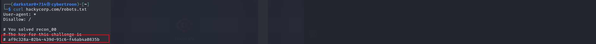
2. you got the flag! `af9c328a-02b4-439d-91c6-f46ab4a0835b`

---

## Recon 01

### OBJECTIVE_01

For this challenge, your goal is to generate a 404/"Not Found" error on the main website for hackycorp.com.

THE 404 PAGES
Not Found/404 pages can leak information about the web stack used by a company or application.

### SOLUTION_01

1. open terminal and write `curl hackycorp.com/just-any-garbage-name-asdfasdf`
   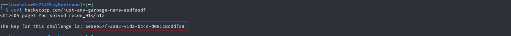
2. you got the flag! `aeaee57f-2a82-41da-bc4c-d081c8cddfc8`

---

## Recon 02

### OBJECTIVE_02

For this challenge, your goal is to retrieve the security.txt from the main website for hackycorp.com.

THE SECURITY.TXT FILE
The security.txt file is used to tell security researchers how they can disclose vulnerabilities for a website. You can learn more about it here: [securitytxt.org](https://securitytxt.org/) and on [Wikipedia: Security.txt](https://en.wikipedia.org/wiki/Security.txt)

### SOLUTION_02

1. open terminal and write `curl hackycorp.com/.well-known/security.txt`
   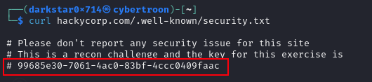
2. you got the flag! `99685e30-7061-4ac0-83bf-4ccc0409faac`

---

## Recon 03

### OBJECTIVE_03

For this challenge, your goal is to find a directory with directory listing in the main website for hackycorp.com.

DIRECTORY LISTING
When accessing a directory on a webserver, multiple things can happen:

an "index" file is present and it will get returned. N.B.: the file is not necessarily named index, this can be configured. But most of the time, the file will benamed index.html
no "index" file is present and the webserver will list the content of the directory. This can obviously leak information.
Indexing directory can be disabled on most webservers. For example, with Apache, you need to use the option: -Indexes.

To find directories, with indexing turned on. You need to browse the source of the HTML pages and look at the directories used to store files. Once you have a list of directories, you can access each of them individually

### SOLUTION_03

1. open your browser and navigate to `hackycorp.com/`
2. view page source and look for directories you will got many directories to subdomines, but also you will find dir named `images`
   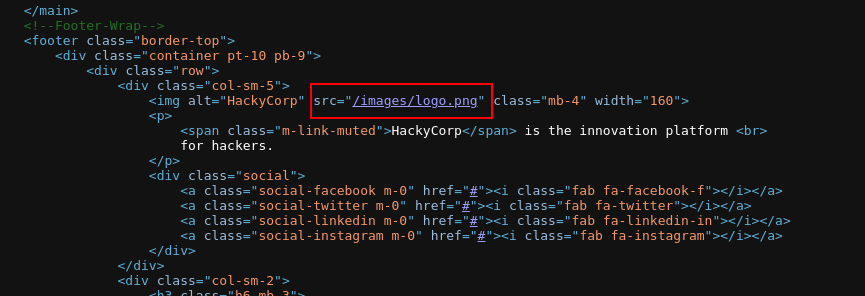
3. navigate to `hackycorp.com/images`
   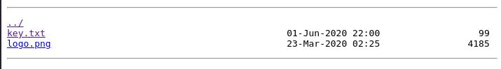
   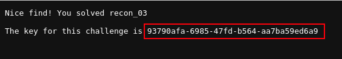
4. you got the flag! `93790afa-6985-47fd-b564-aa7ba59ed6a9`

---

## Recon 04

### OBJECTIVE_04

For this challenge, your goal is to find a directory that is commonly used to manage applications.

INTERESTING DIRECTORIES
When accessing a new webserver, it often pays off to manually check for some directories before starting to brute force using a tool. For example, you can manually check for /admin/.

1. open your browser and navigate to `hackycorp.com/admin/`
   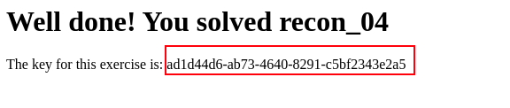
2. you got the flag! `ad1d44d6-ab73-4640-8291-c5bf2343e2a5`

---

## Recon 05

### OBJECTIVE_05

For this challenge, your goal is to find a directory that is not directly accessible.

FUZZING DIRECTORIES
When accessing a new webserver, it often pays off to brute force directories. To do this, you can use many tools like [patator](https://github.com/lanjelot/patator), [FFUF](https://github.com/ffuf/ffuf) or [WFuzz](https://wfuzz.readthedocs.io/en/latest/) (amongst many others).

### SOLUTION_05

1. open the kali linux terminal and write `wfuzz -w {path_to_wordlist} --hc 404 http://hackycorp.com/FUZZ`
   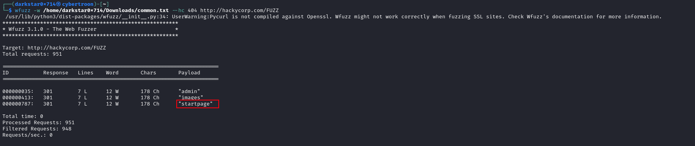
   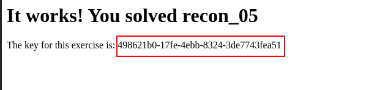
2. you got the flag! `498621b0-17fe-4ebb-8324-3de7743fea51`

---

## Recon 06

### OBJECTIVE_06

For this challenge, your goal is to access the default virtual host ("vhost").

FUZZING DIRECTORIES
When accessing a new webserver, it often pays off to replace the hostname with the IP address or to provide a random Host header in the request. To do this, you can either modify the request in a web proxy or use: `curl -H "Host: ...."`

### SOLUTION_06

1. open the kali linux terminal and write `dig hackycorp.com` to find the IP address of server.
   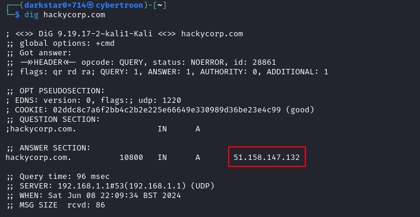
2. using `curl` command to get the web page `curl 51.158.147.132`
   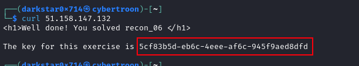

3. you got the flag`5cf83b5d-eb6c-4eee-af6c-945f9aed8dfd`

---

## Recon 07

### OBJECTIVE_07

For this challenge, your goal is to access the default virtual host ("vhost") over TLS.

DEFAULT VHOST OVER TLS
When accessing a new webserver, it often pays off to replace the hostname with the IP address or to provide a random Host header in the request. To do this, you can either modify the request in a web proxy or use:

`curl -H "Host: ...."`

This time you need to check the TLS version of the website to get the key

### SOLUTION_07

1. open the kali linux terminal and write `dig hackycorp.com` to find the IP address of server.
   
2. visit the ip in your browser with `https://51.158.147.132/`.
   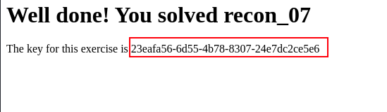
3. you got the flag `23eafa56-6d55-4b78-8307-24e7dc2ce5e6`

---

## Recon 08

### OBJECTIVE_08

For this challenge, your goal is to access the alternative names in the certificate.

ALTERNATIVE NAMES
When accessing a TLS server, it often pays off to check the content of the certificate used. It's common for TLS servers to have certificates that are valid for more than one name (named alternative names). Looking for alternative names can be done in your client or by using openssl.

### SOLUTION_08

1. open firefox browser to the link `www.hackycorp.com`
   
2. click `view certificate`
   
3. open this name `66177e3f25e3ea0713807b1dc5f0b9df.hackycorp.com`
   
4. you got the flag! `1763ec4f-8467-47f7-9a80-6de93a1a2253`

or simply visit [digicert](https://www.digicert.com/help/) and but url on it.

---

## Recon 09

### OBJECTIVE_09

For this challenge, your goal is to access the headers from responses.

HEADER INSPECTION
When accessing a web server, it often pays off to check the responses' headers. It's common to find information around version and technologies used.

### SOLUTION_09

simply we can use burpsuite and open the link `hackycorp.com` in proxy to intercept the request.

but we can use simple approach to get headers by using `curl -i hackycorp.com` command.

1. open the kali linux terminal and write `curl -i hackycorp.com`
   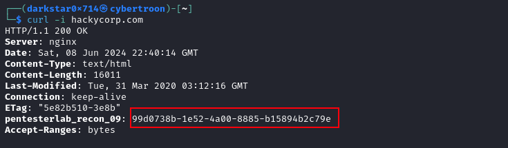
2. you got the flag! `99d0738b-1e52-4a00-8885-b15894b2c79e`

---

## Recon 10

### OBJECTIVE_10

For this challenge, your goal is to use visual reconnaissance. You will need to find the website with the key in red.

VISUAL RECONNAISSANCE
For this challenge, the web applications are hosted under: 0x["%02x"].a.hackycorp.com as in:

0x00.a.hackycorp.com
0x01.a.hackycorp.com
...
0x0a.a.hackycorp.com
0x0b.a.hackycorp.com
...
If you haven't done visual reconnaissance before, you can try to use the tool Aquatone to get images that you can browse easily to find the right key (in red).

### SOLUTION_10

1. install Aquatone tool.

   - download latest version of the tool from [Aquatone tool](https://github.com/michenriksen/aquatone/releases)
   - extract the archive
   - change mode `chmod +x aquatone` then execute the tool `./aquatone`
   - if requested to install chromium then `sudo apt install chromium -y` will solve it
   - make tool system globally accessable `sudo mv aquatone /usr/bin`
2. using python script to get all possible subdomains

    ``` python
    # Generate a list of subdomains from 0x00 to 0xff
    subdomains = [f"http://0x{num:02x}.a.hackycorp.com" for num in range(256)]

    # Print the list of subdomains
    for subdomain in subdomains:
        print(subdomain)
    ```

3. create the list `python3 script.py > aquatone_urls.txt`
4. pipe list to aquatone `cat aquatone_urls.txt | aquatone`
5. after see all screenshots we will find that red key on [red key](http://0x81.a.hackycorp.com/)

    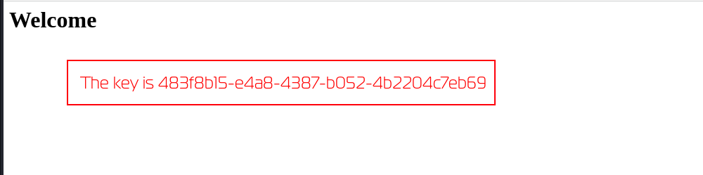
6. you got the flag! `483f8b15-e4a8-4387-b052-4b2204c7eb69`

---

## Recon 11

### OBJECTIVE_11

For this challenge, your goal is to brute a virtual host.

VIRTUAL HOST BRUTE FORCING
In this challenge, you need to brute force a virtual host by only manipulating the Host header. There is no DNS resolution setup for this host. Therefore you will need to target hackycorp.com and bruteforce the virtual host (that ends in .hackycorp.com).

### SOLUTION_11

you can use wfuzz or fuff tools to bruteforce it.
but i will use new tool for me in `burpsuite` called `intruder`.

1. open burpsuite proxy and active it then open built-in browser and send request to `intruder`.
   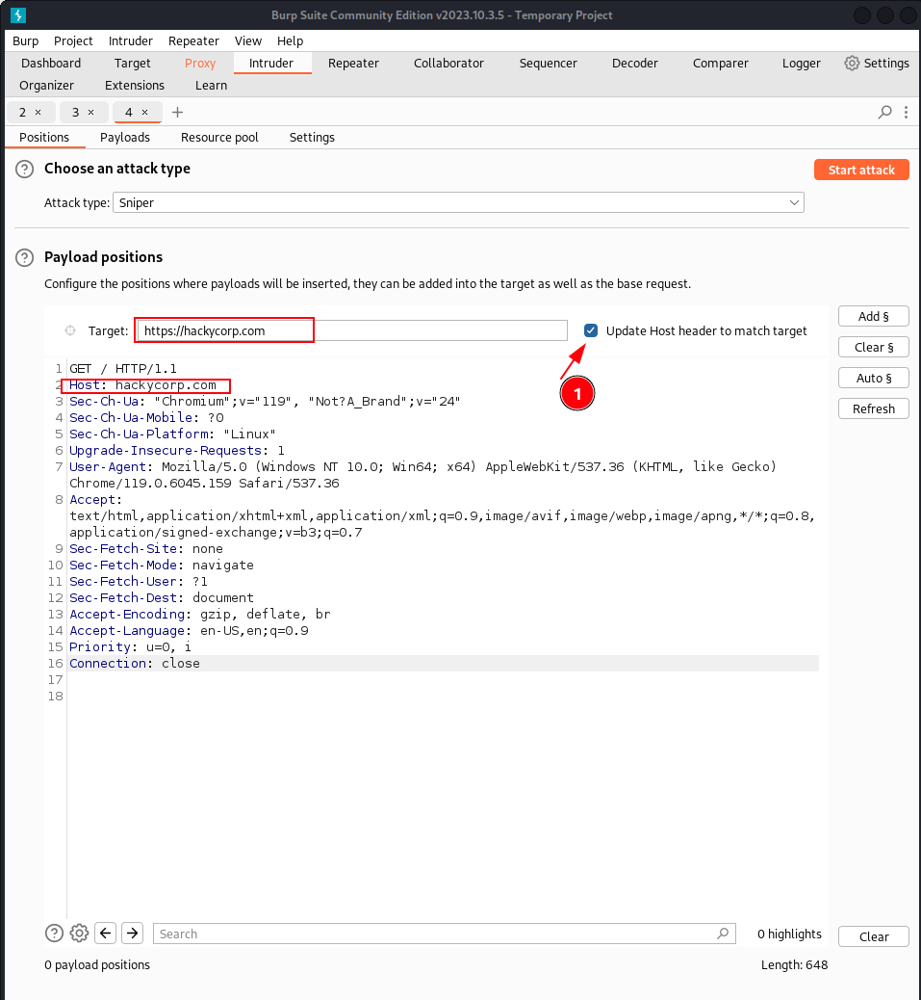
2. uncheck the `update Host Header` checkbox.
3. make placeholder in host to find sub-domain.
   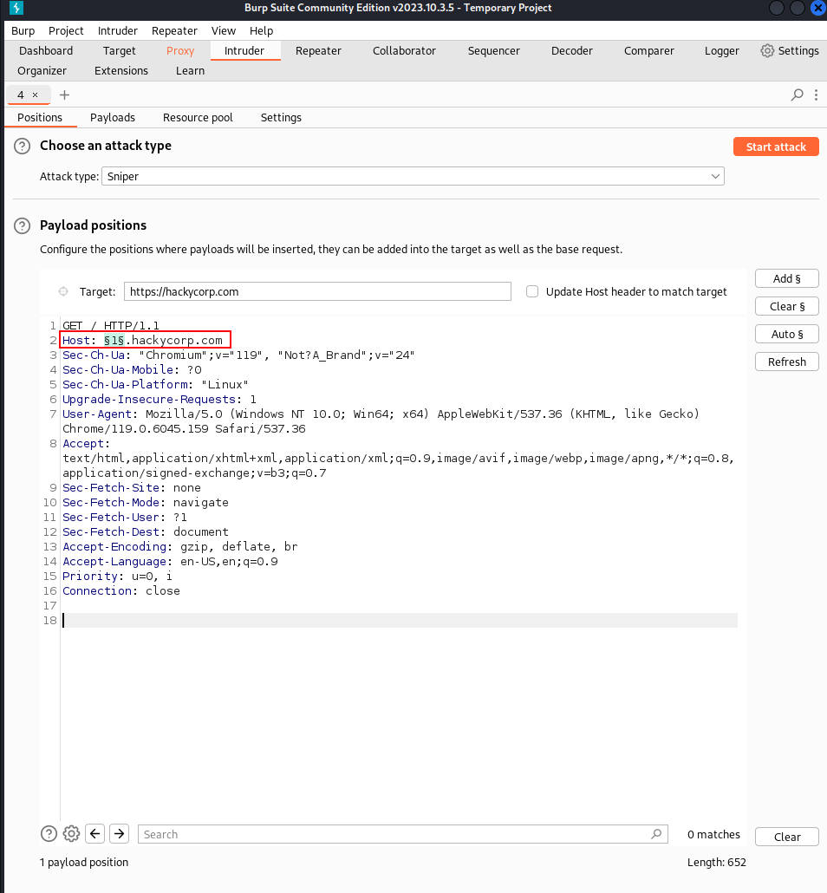
4. load your payload in intruder and start attack.
   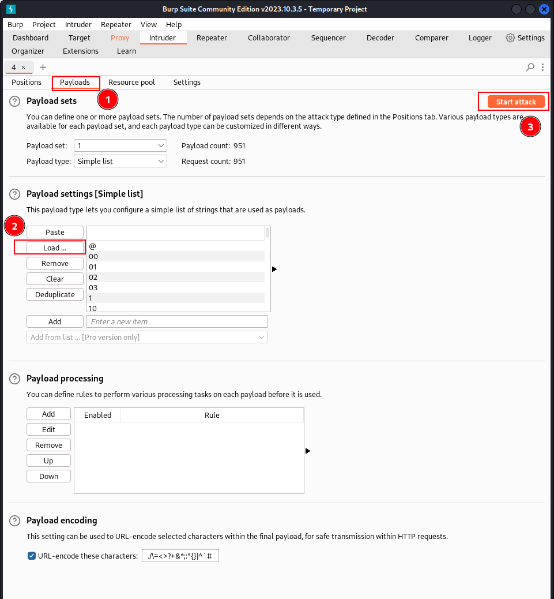
5. after sorting the result by length and you got the flag `e4599fa9-1cc4-4916-a394-ce455a954d86`.
   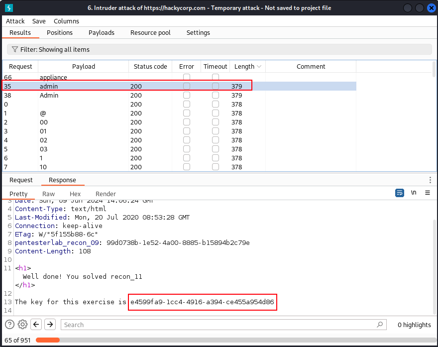

---

## Recon 12

### OBJECTIVE_12

For this challenge, your goal is to access a load-balanced application hosted at the address balancer.hackycorp.com.

LOAD BALANCING
Serving requests for a single application can be done by multiple backends. It can pay off to send the same request multiple times to check if multiple backends are involved.

### SOLUTION_12

1. open the link in browser `http://balancer.hackycorp.com`.
   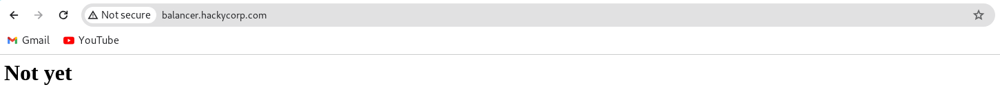
2. reload the page couple of times and we got the flag `29e5c97c-7230-46ae-937c-6c56ff33b84f`
   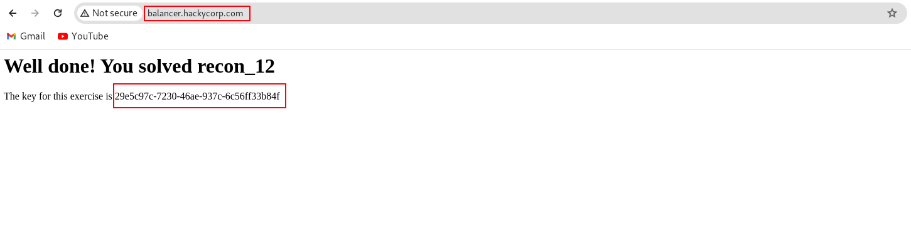

---

## Recon 13

### OBJECTIVE_13

For this challenge, your goal is to retrieve the TXT record for key.z.hackycorp.com.

TXT RECORD
TXT records are often used to show that people own a domain or to store information to configure services, it's always a good idea to check for those.

### SOLUTION_13

1. open kali linux terminal and write `dig -t TXT key.z.hackycorp.com` to get DNS TXT records.
   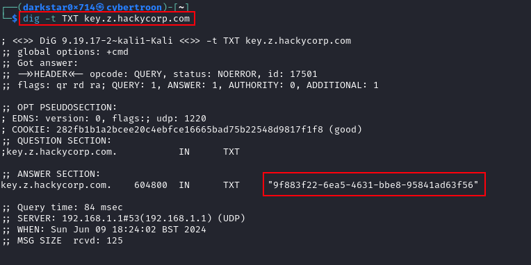
2. you got the flag `9f883f22-6ea5-4631-bbe8-95841ad63f56`

---

## Recon 14

### OBJECTIVE_14

For this challenge, your goal is to perform a zone transfer on z.hackycorp.com.

ZONE TRANSFER
Zone transfers are usually used to synchronise multiple DNS servers. Only a list of pre-defined hosts should be able to perform this operation. However, it's sometimes possible to retrieve this information and can give you access to new hosts.

### SOLUTION_14

1. to make zone transfer we need to use `dig -t axfr z.hackycorp.com @z.hackycorp.com`
   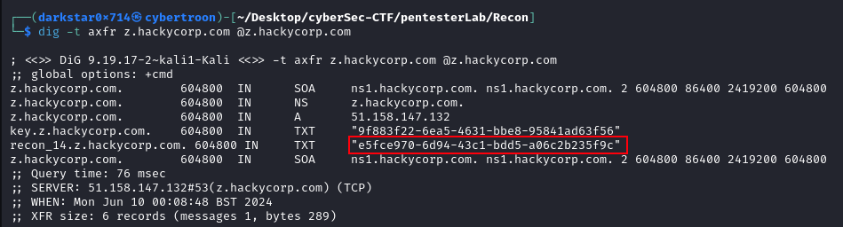

---

## Recon 15

### OBJECTIVE_15

For this challenge, your goal is to perform a zone transfer on the internal zone named: "int" using the nameserver of z.hackycorp.com.

ZONE TRANSFER
Zone transfers are usually used to synchronise multiple DNS servers. Only a list of pre-defined hosts should be able to perform this operation. However, it's sometimes possible to retrieve information from internal zones by asking publicly available servers.

### SOLUTION_15

1. same as previous one `dig -t axfr int @z.hackycorp.com`.
2. and we got the flag `b55b45a8-63b1-42f7-bd12-a36219ff883d`
   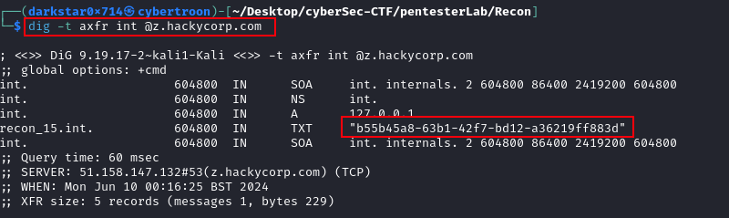

---

## Recon 16

### OBJECTIVE_16

For this challenge, your goal is to get the version of bind used by z.hackycorp.com.

BIND
Bind is one of the most common DNS server used. If you know how to ask, it will reveal you its version.

### SOLUTION_16

1. open the terminal and write `dig @z.hackycorp.com version.bind TXT CHAOS`
2. and you got the flag `4e5e76e1-728a-49be-aea8-4591ba11e588`
   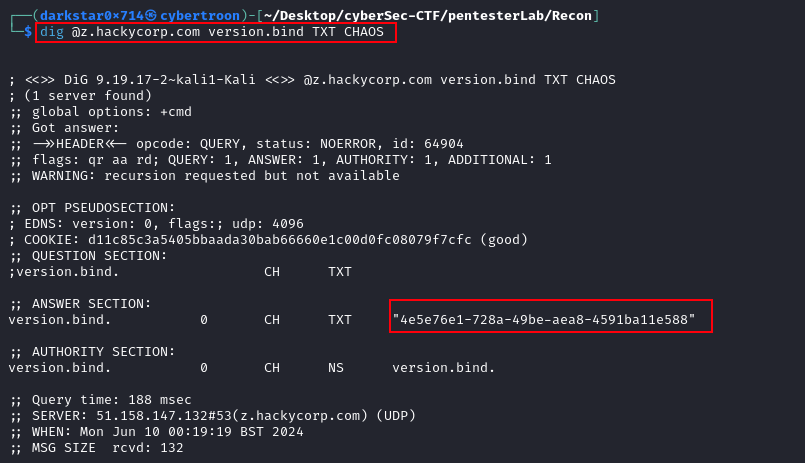

---

## Recon 17

### OBJECTIVE_17

For this challenge, your goal is to look at the name of the developer who committed code for the organisation in the repository test1 on Github (you will need to find the Github account for Hackycorp first).

### SOLUTION_17

1. using google dork `"hackycorp" site:github.com`.
2. we got a github account `https://github.com/orgs/hackycorp` going to test1 and we got the flag `d0fad5ef-ebb2-467c-8868-34e3cf4878b4`
   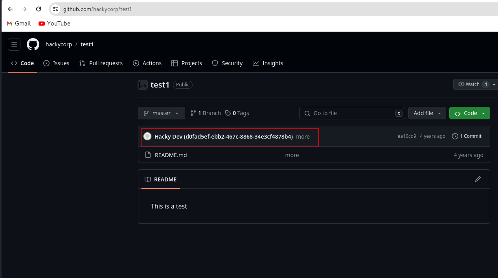

---

## Recon 18

### OBJECTIVE_18

For this challenge, your goal is to look at the public repository of the developers of the organisation.

### SOLUTION_18

1. using google dork `"hackycorp" site:github.com`.
2. you got an account there is one developer on this [hackycorp](https://github.com/hackycorp).
   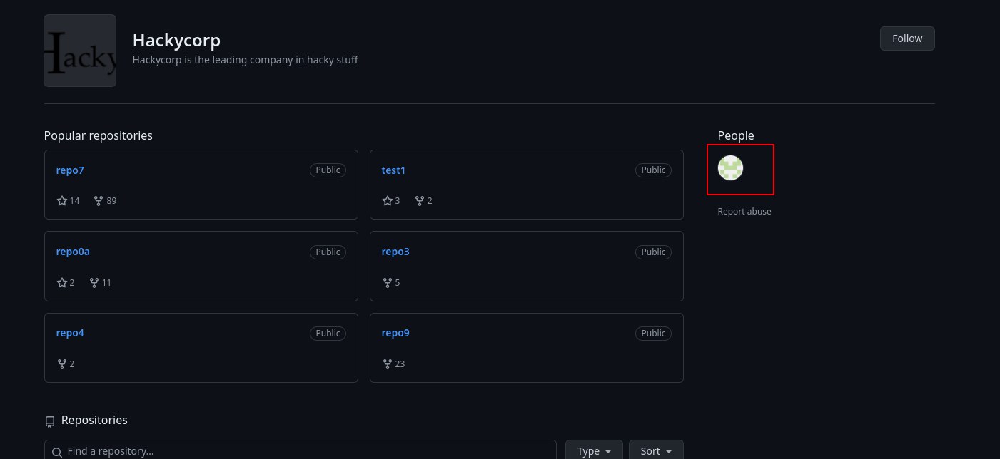
3. go to this public repo.
   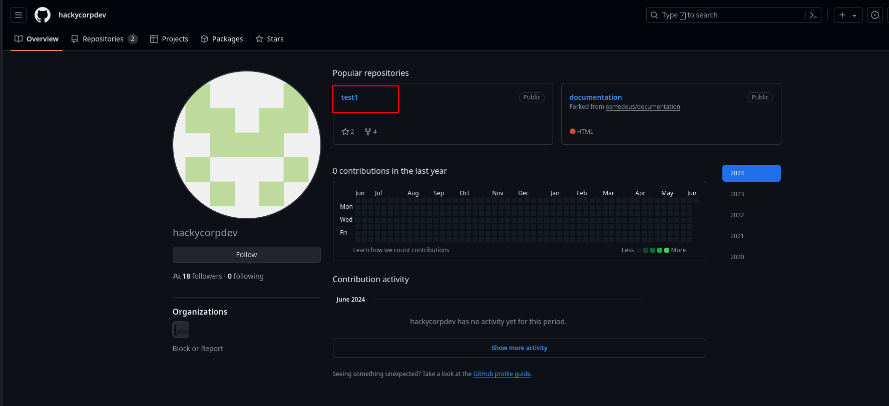
   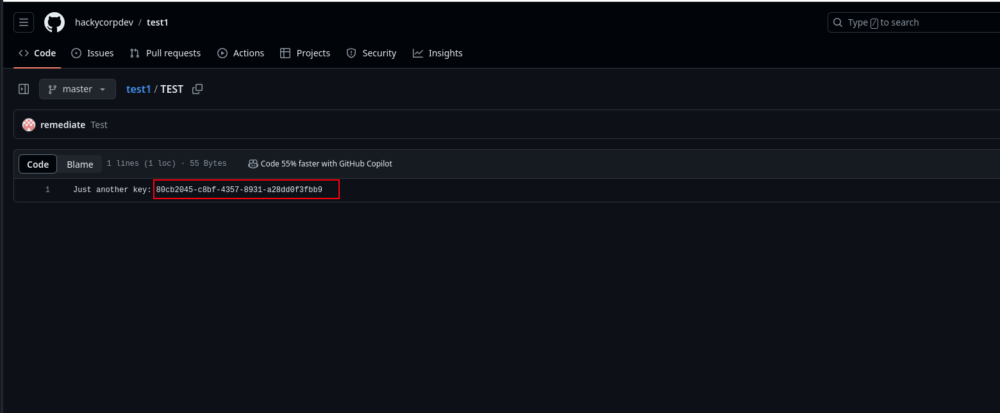
4. you got the flag `80cb2045-c8bf-4357-8931-a28dd0f3fbb9`

---

## Recon 19

### OBJECTIVE_19

For this challenge, your goal is to look at the repository repo7 and find an email address that is not like the other one.

WHY?
Developers often commit with the wrong email address and that may leak some information about personal accounts or internal systems.

### SOLUTION_19

1. open the repo [repo7](https://github.com/hackycorp/repo7).
2. make local clone from repo `git clone https://github.com/hackycorp/repo7`
3. using this command `git log --pretty=format:'%ae'` we can get email addresses used to commit.
   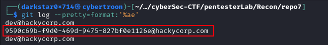
4. you got the flag `9590c69b-f9d0-469d-9475-827bf0e1126e`

---

## Recon 20

### OBJECTIVE_20

For this challenge, your goal is to look at the repository repo3 and check different branches.

WHY?
It's important to look at all branches as they may be used to store sensitive information.

### SOLUTION_20

1. open the repo and branches.
   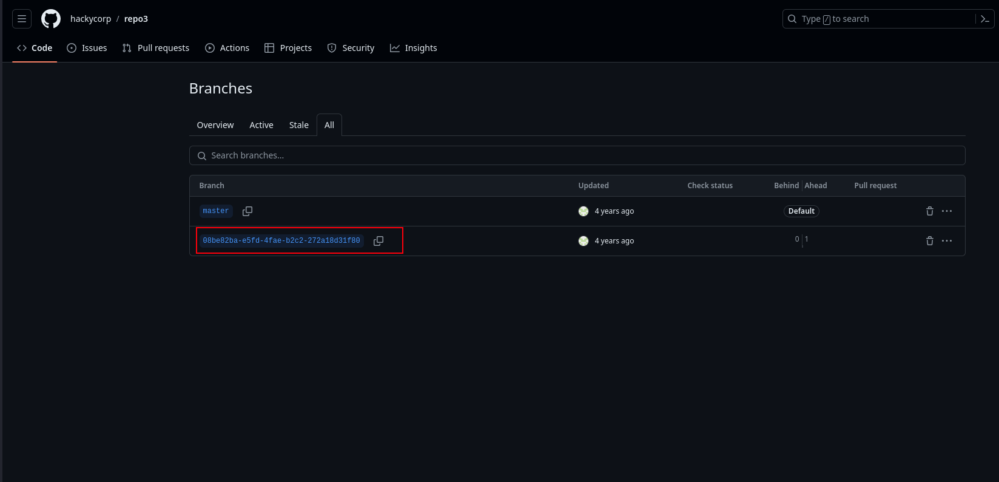
2. you got the flag `08be82ba-e5fd-4fae-b2c2-272a18d31f80`

---

## Recon 21

### OBJECTIVE_21

For this challenge, your goal is to look at the repository repo4 and check different branches.

WHY?
It's important to look at all branches as they may be used to store sensitive information.

### SOLUTION_21

same as previous one.
we got the flag `a60b4aee-642a-483b-9262-ccfc2ed46f0d`

---

## Recon 22

### OBJECTIVE_22

For this challenge, your goal is to find a file that has been deleted in repo9.

WHY?
Often, when committing secrets by mistake, developers just remove the file and commit again. Leaving the information available for anyone willing to search for it.

### SOLUTION_22

1. after browsing the repo `git clone https://github.com/hackycorp/repo9`
2. make local copy of it using `git clone https://github.com/hackycorp/repo9`
   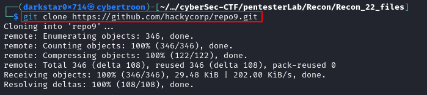
3. by search about deleted files we got the flag `3ee505c2-8aa9-4d5e-810e-921778dce1e6`
   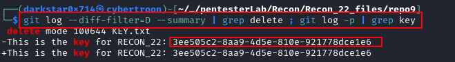

---

## Recon 23

### OBJECTIVE_23

For this challenge, your goal is to look at the repository repo0a and find sensitive information in the commit message.

WHY?
It's important to look at commit messages and search for keywords.

### SOLUTION_23

1. open the repo `https://github.com/hackycorp/repo0a`
2. by browsing the commits names we got the flag `5c75cfe9-52dd-475b-8cfa-7ffc492abeca`
   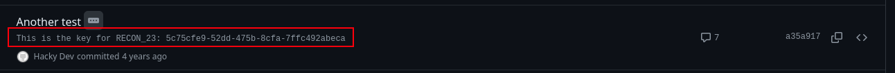

---

## Recon 24

### OBJECTIVE_24

For this challenge, your goal is to look at the server used to load assets (JavaScript, CSS) and find a file named key.txt.

WHY?
It's essential to look for files that may be publicly available on the servers used to load assets.

### SOLUTION_24

1. go to [hackycorp.com](https://hackycorp.com) and view page source.
   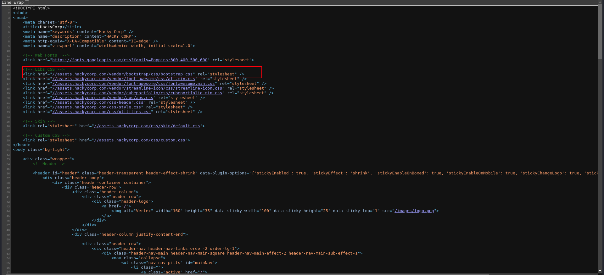
2. try to traversal to required asset `key.txt` [key](https://assets.hackycorp.com/key.txt) and we got the flag `e94ab8a5-b0c1-4559-8bc7-cae2e53b10e0`.
   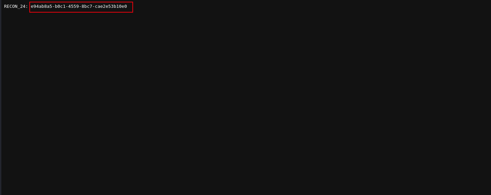

---

## Recon 25

### OBJECTIVE_25

For this challenge, your goal is to look at the server used to load assets (JavaScript, CSS) and find a file named key2.txt. However, this time you will need to be logged in to access it.

Amazon Web Services Storage Service (S3) allows file owners to set permissions on files. Historically, the rules "Any users" wasn't well explained and lead a lot of people to think only people in their Amazon account could access a file. However, this was allowing any AWS account to access the file.

WHY?
It's essential to look for files that may be publicly available on the servers used to load assets.

### SOLUTION_25

1. after viewing error message, it seem like s3 permission error,
   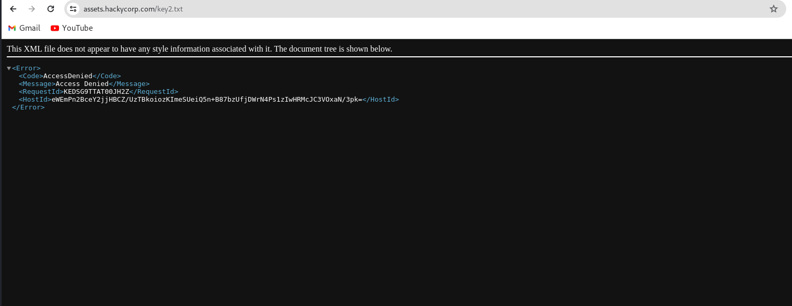 
2. install aws cli `sudo apt install awscli -y`
3. here you need to AWS credentials.
4. after enter your AWS credentials, you can run the command `aws s3 cp s3://assets.hackycorp.com/key2.txt ./` because of most times the s3 bucket named as domain.
5. and we got the flag `ff360948-c048-4f0c-a302-e806c50192d9`.
   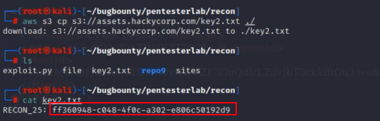

---

## Recon 26

### OBJECTIVE_26

For this challenge, your goal is to look at the server used to load assets (JavaScript, CSS) and find a hardcoded key in one of the JavaScript files.

WHY?
It's essential to inspect JavaScript files for hardcoded keys.

### SOLUTION_26

1. view page source code
2. search for all `.js` files
   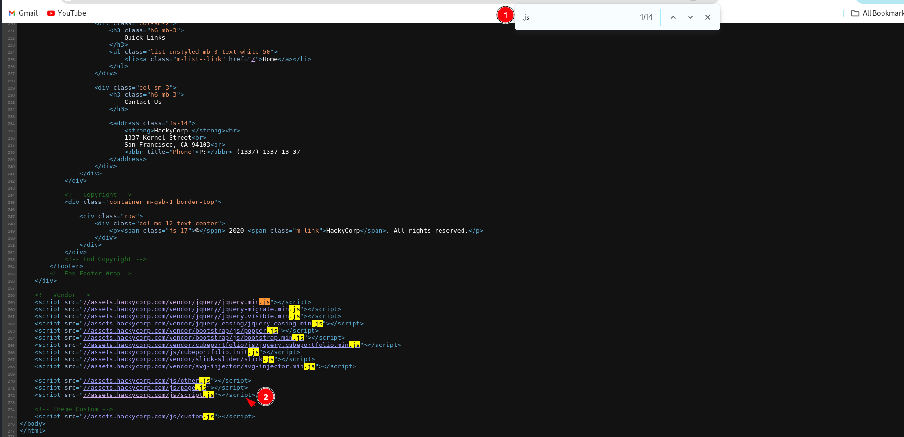
3. open `script.js` file and read the content of the file and we got the flag `d6b75269-97a3-44de-be32-fff0dd55e7ef`
   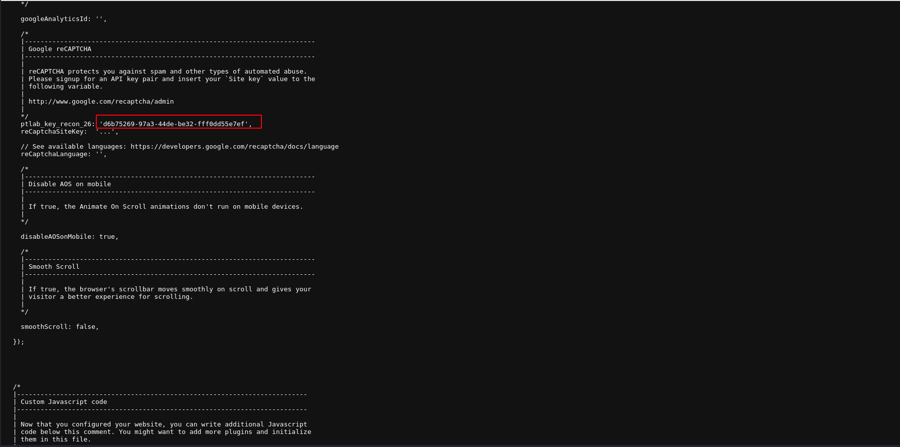