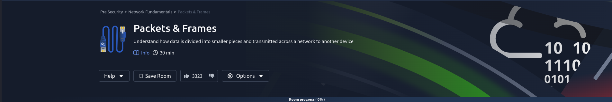

# Packets & Frames



## Room objectives

- difference between packets and frame
- some of packet headers
  - Time To Live
  - Checksum
  - Source Address
  - Destination Address

## Tasks

### Task 1 : What are Packets and Frames

<details>
<summary>
What is the name for a piece of data when it does have IP addressing information?
</summary>

```
packet
```

</details>

<details>
<summary>
What is the name for a piece of data when it does not have IP addressing information?
</summary>

```
frame
```

</details>

---

### Task 2 : TCP/IP (The Three-Way Handshake)

<details>
<summary>
What is the name for a piece of data when it does have IP addressing information?
</summary>

```
packet
```

</details>

<details>
<summary>
What is the name for a piece of data when it does not have IP addressing information?
</summary>

```
frame
```

</details>
