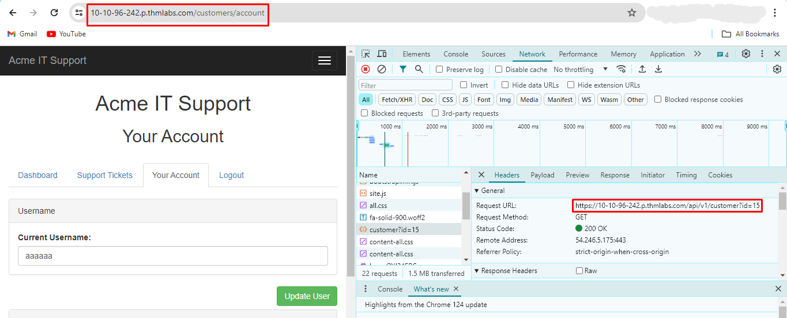

# IDOR


## Room objectives

- what is IDOR?
- basic IDORs
- encoded IDORs
- hashed IDORs
- Unpredictable IDs IDORs
- how to find IDOR vulnerability

## Tasks

### Task 1 : What is an IDOR?

<details>
<summary>
What does IDOR stand for?
</summary>

```
Insecure Direct Object Reference
```

</details>

---

### Task 2 : An IDOR Example

<details>
<summary>
What is the Flag from the IDOR example website?
</summary>

`after edit URL with another user id you got the flag`


```
THM{IDOR-VULN-FOUND}
```

</details>

---

### Task 3 : Finding IDORs in Encoded IDs

<details>
<summary>
What is a common type of encoding used by websites?
</summary>

```
base64
```

</details>

---

### Task 4 : Finding IDORs in Hashed IDs

<details>
<summary>
What is a common algorithm used for hashing IDs?
</summary>

```
md5
```

</details>

---

### Task 5 : Finding IDORs in Unpredictable IDs

<details>
<summary>
What is the minimum number of accounts you need to create to check for IDORs between accounts?
</summary>

```
2
```

</details>

---

### Task 6 : Where are IDORs located

<details>
<summary>
Read the above.
</summary>

```
No answer needed
```

</details>

---

### Task 7 : A Practical IDOR Example

<details>
<summary>
What is the username for user id 1?
</summary>

1. create an account and log.
2. open network tap in developers tools
3. you will find end point with id `https://10-10-96-242.p.thmlabs.com/api/v1/customer?id=15`
   
   this end point show your account privet data
   
4. make a copy then edit id to 1 and you got the user data
   

```
adam84
```

</details>

<br>

<details>
<summary>
What is the email address for user id 3?
</summary>


```
j@fakemail.thm
```

</details>
