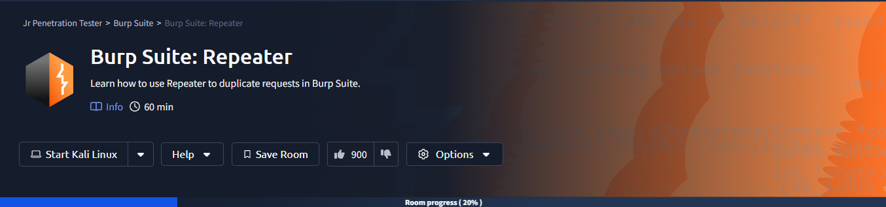

# Burp Suite: Repeater



## Room objectives

- what is the repeater and how to use it.

## Tasks

### Task 1 : Introduction

<details>
<summary>
Let us start!
</summary>

```
No answer needed
```

</details>

---

### Task 2 : What is Repeater

<details>
<summary>
Which sections gives us a more intuitive control over our requests?
</summary>

```
Inspector
```

</details>

---

### Task 3 : Basic Usage

<details>
<summary>
Which view will populate when sending a request from the Proxy module to Repeater?
</summary>

```
Request
```

</details>

---

### Task 4 : Message Analysis Toolbar

<details>
<summary>
Which option allows us to visualize the page as it would appear in a web browser?
</summary>

```
Render
```

</details>

---

### Task 5 : Inspector

<details>
<summary>
Which section in Inspector is specific to POST requests?
</summary>

```
Body Parameters
```

</details>

---

### Task 6 : Practical Example

<details>
<summary>
What is the flag you receive?
</summary>

<br>

`after opening link in browser > active the foxyProxy > turn proxy in burp on > reload page > add header > forward the request`

<br>


<br>


```
THM{Yzg2MWI2ZDhlYzdlNGFiZTUzZTIzMzVi}
```

</details>

---

### Task 7 : Challenge

<details>
<summary>
Enable intercept again and capture a request to one of the numeric products endpoints in the Proxy module, then forward it to Repeater.
</summary>

```
No answer needed
```

</details>

<br>

<details>
<summary>
What is the flag you receive when you cause a 500 error in the endpoint?
</summary>

1. by try input 0 we got 404
2. by try high input like 100 we got 404
3. by try negative input we got error 500 with flag

<br>


```
THM{N2MzMzFhMTA1MmZiYjA2YWQ4M2ZmMzhl}
```

</details>

---

### Task 8 : Extra-mile Challenge

<details>
<summary>
What is the flag?
</summary>

*this task require knowledge about SQLI*

```
THM{ZGE3OTUyZGMyMzkwNjJmZjg3Mzk1NjJh}
```

</details>

---

### Task 9 : Conclusion

<details>
<summary>
I can use Burp Suite Repeater!
</summary>

```
No answer needed
```

</details>
