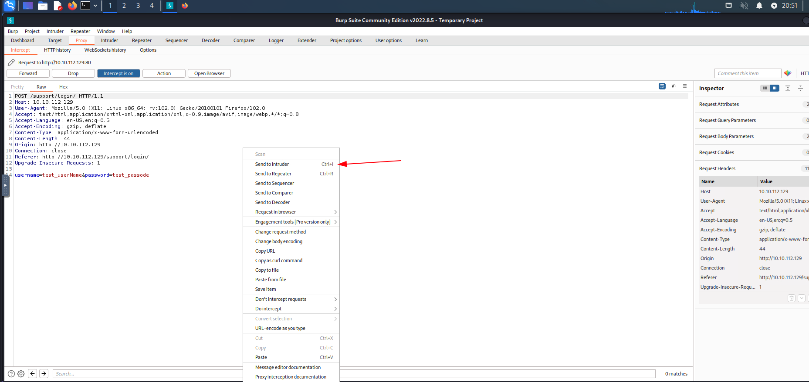
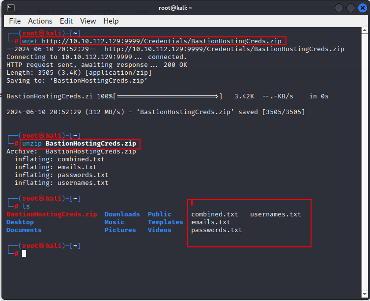
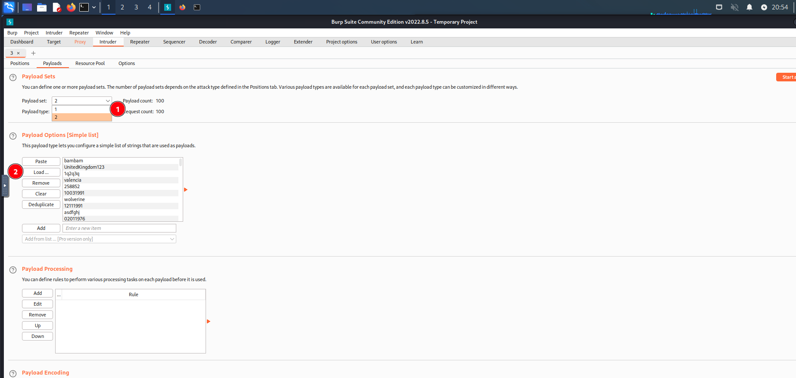
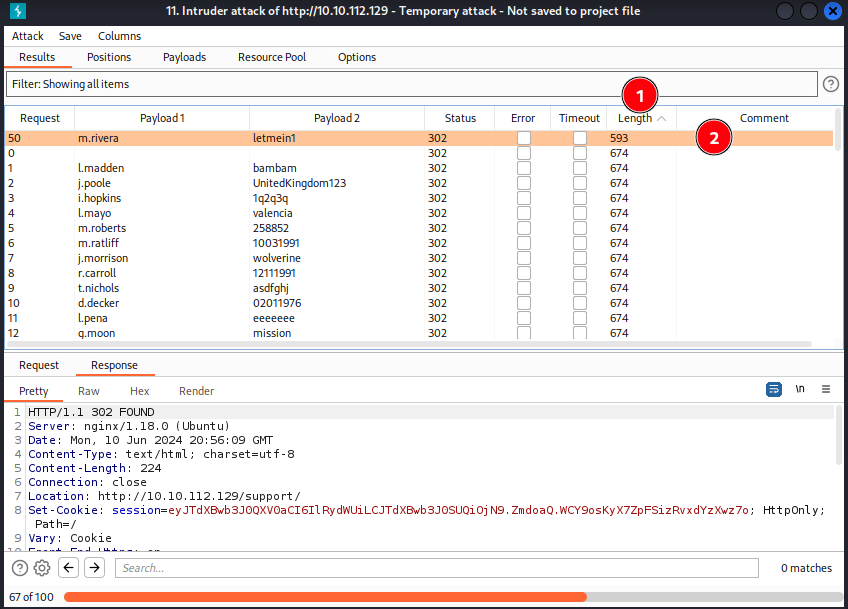
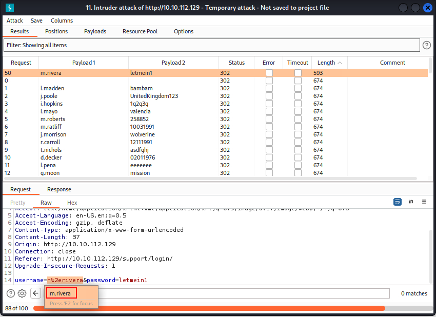
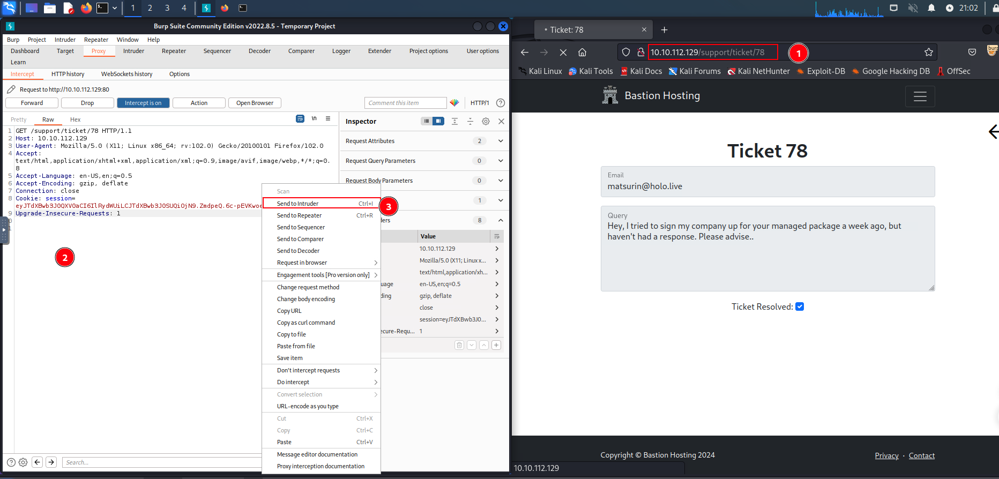
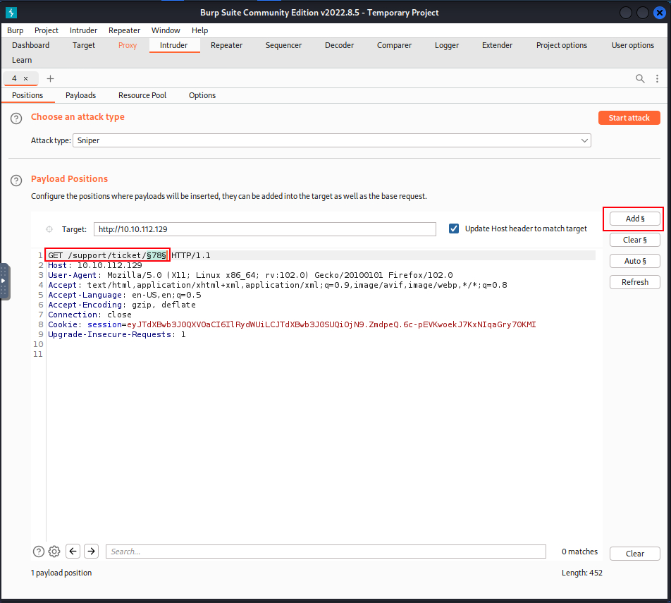
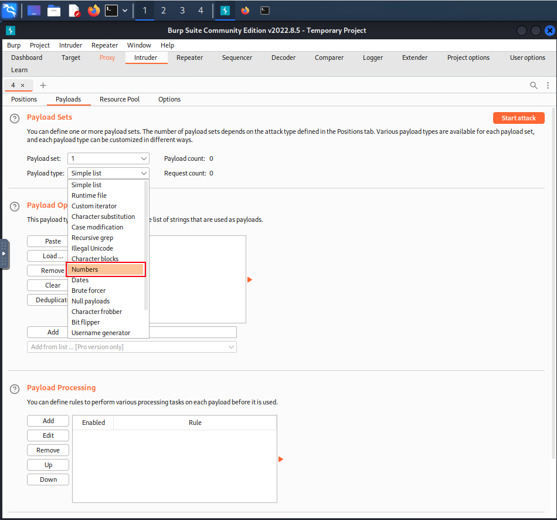
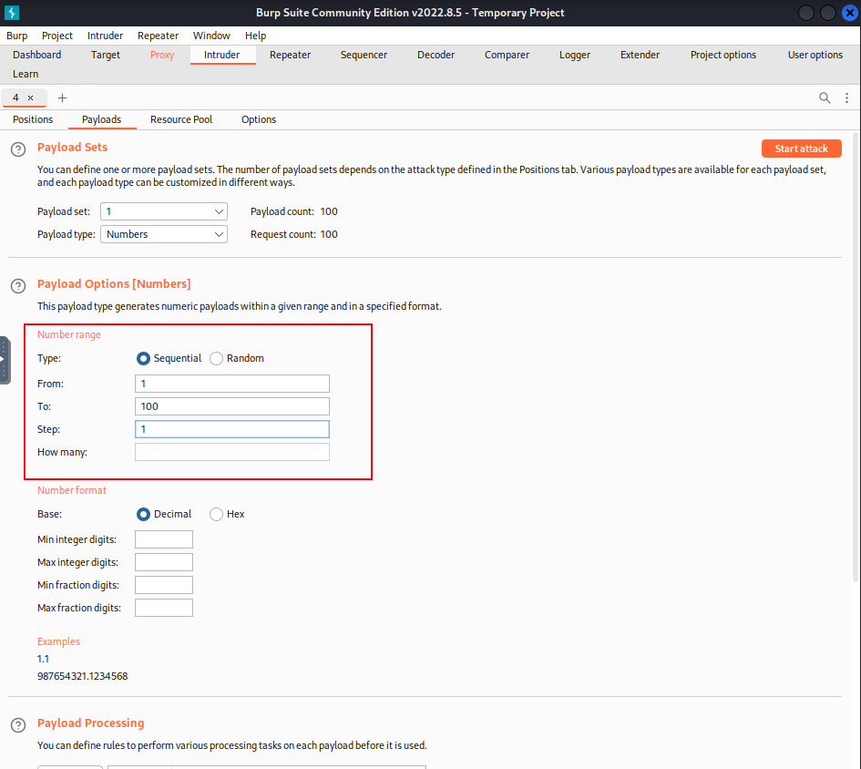
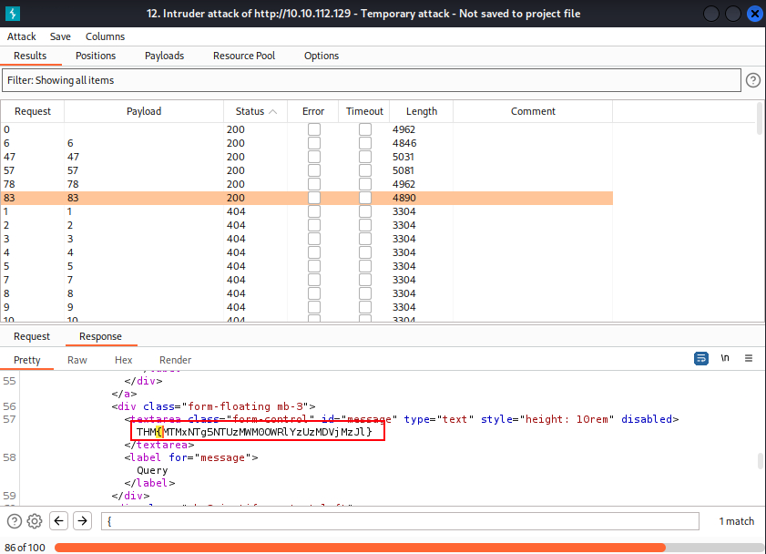

# Burp Suite: Intruder


## Room objectives

- what is the intruder and how to use it.
- attacks types:
  - spider
  - Battering Ram
  - Pitchfork
  - Cluster Bomb

## Tasks

### Task 1 : Introduction

<details>
<summary>
Let's get started!
</summary>

```
No answer needed
```

</details>

---

### Task 2 : what is intruder?

<details>
<summary>
In which Intruder tab can we define the "Attack type" for our planned attack?
</summary>

```
Positions
```

</details>

---

### Task 3 : Positions

<details>
<summary>
What symbol defines the start and the end of a payload position?
</summary>

```
§
```

</details>

---

### Task 4 : Payloads

<details>
<summary>
Which Payload processing rule could we use to add characters at the end of each payload in the set?
</summary>

1. after intercept a request send it to the intruder
2. open intruder tab
3. add process rule
4. you will find the answer `Add suffix`

```
Add suffix
```

</details>

---

### Task 5 : Introduction to Attack Types

<details>
<summary>
What attack type cycles through the payloads inserting one payload at a time into each position defined in the request?
</summary>

```
Sniper
```

</details>

---

### Task 6 : Sniper

<details>
<summary>
If you were using Sniper to fuzz three parameters in a request with a wordlist containing 100 words, how many requests would Burp Suite need to send to complete the attack?
</summary>

the answer is multiply number of parameters *wordList length --> 3*100 = 300

```
300
```

</details>

<br>

<details>
<summary>
How many sets of payloads will Sniper accept for conducting an attack?
</summary>

```
1
```

</details>

---

### Task 7 : Battering Ram

<details>
<summary>
As a hypothetical question: You need to perform a Battering ram Intruder attack on the example request above.

If you have a wordlist with two words in it (admin and Guest) and the positions in the request template look like this:
username=§pentester§&password=§Expl01ted§

What would the body parameters of the first request that Burp Suite sends be?
</summary>

```
username=admin&password=admin
```

</details>

---

### Task 8 : Pitchfork

<details>
<summary>
What is the maximum number of payload sets we can load into Intruder in Pitchfork mode?
</summary>

```
20
```

</details>

---

### Task 9 : Cluster Bomb

<details>
<summary>
We have three payload sets. The first set contains 100 lines, the second contains 2 lines, and the third contains 30 lines.

How many requests will Intruder make using these payload sets in a Cluster bomb attack?
</summary>
requests = 100 * 2 * 30 = 6000

```
6000
```

</details>

---

### Task 10 : Practical Example

<details>
<summary>
What username and password combination indicates a successful login attempt? The answer format is "username:password".
</summary>

1. after intercept the request send it to the intruder
   
2. then download the recommended wordlist using `wget http://10.10.112.129:9999/Credentials/BastionHostingCreds.zip` & unzip it --> we got 4 lists.
   
3. by load payloads into intruder and start attack.
   
4. filter by length and check the results after some times we got some thing different.
   
5. by browsing the response we can get the answer.
   

```
m.rivera:letmein1
```

</details>

---

### Task 11 : Practical Challenge

<details>
<summary>
Which attack type is best suited for this task?
</summary>

```
Sniper
```

</details>

<br>

<details>
<summary>
Configure an appropriate position and payload (the tickets are stored at values between 1 and 100), then start the attack.

You should find that at least five tickets will be returned with a status code 200, indicating that they exist.
</summary>

```
No answer needed
```

</details>

<br>

<details>
<summary>
Either using the Response tab in the Attack Results window or by looking at each successful (i.e. 200 code) request manually in your browser, find the ticket that contains the flag.

What is the flag?
</summary>

1. after intercept the request send it to the intruder
   
2. and make placeholder in the request url in position tap.
   
3. after open payload tab and change payload type to Number
   
4. change setting from number 1 to number 100 with steps 1
   
5. after start attack and filter by status code and review all 200 codes we got the answer.
   

```
THM{MTMxNTg5NTUzMWM0OWRlYzUzMDVjMzJl}
```

</details>

---

### Task 12 : Extra Mile Challenge

<details>
<summary>
What username and password combination indicates a successful login attempt? The answer format is "username:password".
</summary>

```
o.bennett:bella1
```

</details>

---

### Task 13 : Conclusion

<details>
<summary>
I can use Intruder!
</summary>

```
No answer needed
```
