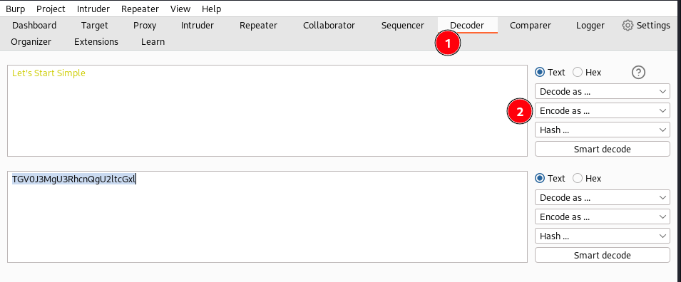
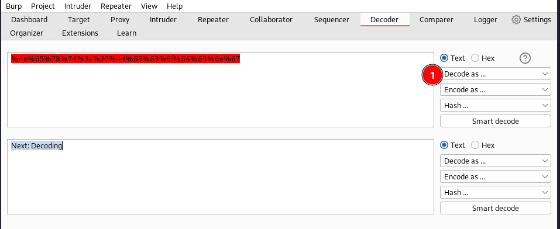
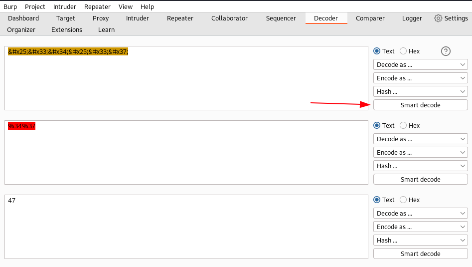
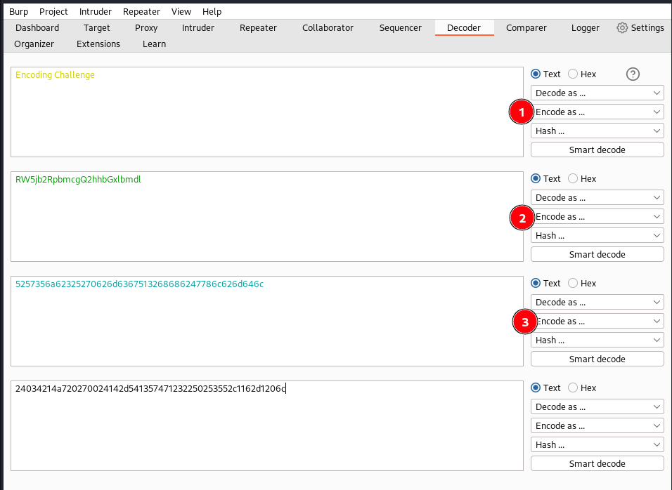
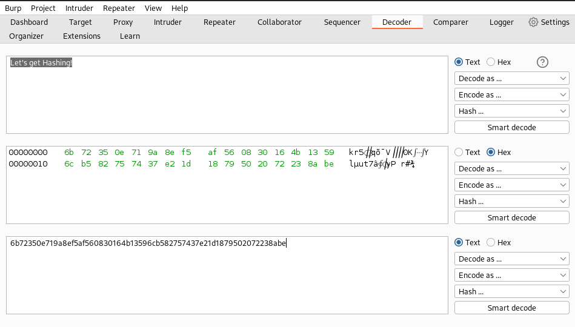
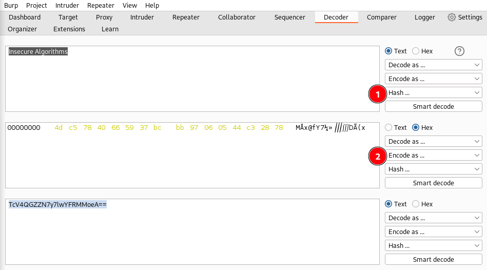
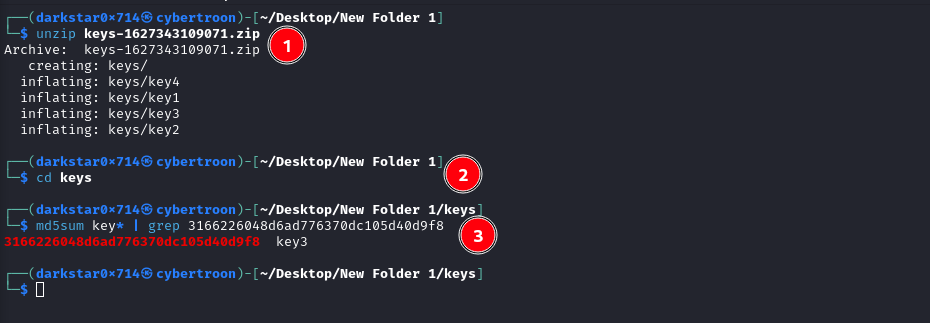

# Burp Suite: Other Modules


## Room objectives

- decode module
- comparer module
- sequencer module
- organizer module

## Tasks

### Task 1 : Introduction

<details>
<summary>
Deploy the machine attached to the task by pressing the green Start Machine button, as well as the AttackBox (using the Start AttackBox button at the top of the page) if you are not using your own machine.
</summary>

```
No answer needed
```

</details>

---

### Task 2 : Decoder : Overview

<details>
<summary>
Which feature attempts auto-decode of the input?
</summary>

```
Smart decode
```

</details>

---

### Task 3 : Decoder: Encoding/Decoding

<details>
<summary>
Base64 encode the phrase: Let's Start Simple.

What is the base64 encoded version of this text?
</summary>

1. open decode module paste your text `Let's Start Simple`
2. encode it using base64
   

```
TGV0J3MgU3RhcnQgU2ltcGxl
```

</details>

<br>

<details>
<summary>
URL Decode this data: %4e%65%78%74%3a%20%44%65%63%6f%64%69%6e%67.

What is the plaintext returned?
</summary>

1. open decode module paste your text `%4e%65%78%74%3a%20%44%65%63%6f%64%69%6e%67`
2. decode it with URl
    

```
Next: Decoding
```

</details>

<br>

<details>
<summary>
Use Smart decode to decode this data: &#x25;&#x33;&#x34;&#x25;&#x33;&#x37;.

What is the decoded text?
</summary>

1. open decode module paste your text `&#x25;&#x33;&#x34;&#x25;&#x33;&#x37;`
2. decode it using smart decode
   

```
47
```

</details>

<br>

<details>
<summary>
Encode this phrase: Encoding Challenge.

Start with base64 encoding. Take the output of this and convert it into ASCII Hex. Finally, encode the hex string into octal.

What is the final string?
</summary>

1. open decode module paste your text `Encoding Challenge`
2. encode it using base64
3. decode it with ASCII Hex
4. decode it with octal
   

```
24034214a720270024142d541357471232250253552c1162d1206c
```

</details>

---

### Task 4 : Decoder: Hashing

<details>
<summary>
Using Decoder, what is the SHA-256 hashsum of the phrase: Let's get Hashing!?

Convert this into an ASCII Hex string for the answer to this question.
</summary>

1. open decode module paste your text `Let's get Hashing!`
2. hash it with SHA-256
3. convert it to ASCII Hex
   

```
6b72350e719a8ef5af560830164b13596cb582757437e21d1879502072238abe
```

</details>

<br>

<details>
<summary>
Generate an MD4 hashsum of the phrase: Insecure Algorithms.

Encode this as base64 (not ASCII Hex) before submitting.
</summary>

1. open decode module paste your text `Insecure Algorithms`
2. hash it with MD4
3. encode it using base64
   

```
TcV4QGZZN7y7lwYFRMMoeA==
```

</details>

<br>

<details>
<summary>
"Some joker has messed with my SSH key! There are four keys in the directory, and I have no idea which is the real one. The MD5 hashsum for my key is 3166226048d6ad776370dc105d40d9f8 — could you find it for me?"

What is the correct key name?
</summary>

1. download task file
2. unzip it using `unzip keys-1627343109071.zip`
3. change your dir to the folder
4. get hash of all files and compare it with given key using `md5sum key* | grep 3166226048d6ad776370dc105d40d9f8`
   

```
key3
```

</details>

---

### Task 5 : Comparer: Overview

<details>
<summary>
Click me to proceed to the next task.
</summary>

```
No answer needed
```

</details>

---

### Task 6 : Comparer: Example

<details>
<summary>
Compare the two responses by word. Can you identify the main differences?
</summary>

```
No answer needed
```

</details>

---

### Task 7 : Sequencer: Overview

<details>
<summary>
What does Sequencer allow us to evaluate?
</summary>

```
Entropy
```

</details>

---

### Task 8 : Sequencer: Live Capture

<details>
<summary>
What is the overall quality of randomness estimated to be?
</summary>

```
excellent
```

</details>

---

### Task 9 : Sequencer: Analysis

<details>
<summary>
Click me to proceed to the next task.
</summary>

```
No answer needed
```

</details>

---

### Task 10 : Organizer: Overview

<details>
<summary>
Are saved requests read-only? (yea/nay)
</summary>

```
yea
```

</details>

---

### Task 11 : Conclusion

<details>
<summary>
I understand how to use Organizer, Decoder, Sequencer, and Comparer!
</summary>

```
No answer needed
```

</details>
