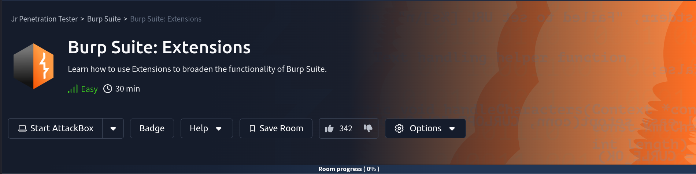

# Burp Suite: Extensions



## Room objectives

- install burp extensions

## Tasks

### Task 1 : Introduction

<details>
<summary>
Click me to proceed to the next task.
</summary>

```
No answer needed
```

</details>

---

### Task 2 : The Extensions Interface

<details>
<summary>
Are extensions invoked in ascending (A) or descending (D) order?
</summary>

```
D
```

</details>

---

### Task 3 : The BApp Store

<details>
<summary>
Click me to proceed to the next task.
</summary>

```
No answer needed
```

</details>

---

### Task 4 : Jython

<details>
<summary>
Click me to proceed to the next task.
</summary>

```
No answer needed
```

</details>

---

### Task 5 : The Burp Suite API

<details>
<summary>
Click me to proceed to the next task.
</summary>

```
No answer needed
```

</details>

---

### Task 6 : Conclusion

<details>
<summary>
I can use Burp Suite Extensions!
</summary>

```
No answer needed
```

</details>

---
