# [Lab4: Broken brute-force protection, IP block](https://portswigger.net/web-security/authentication/password-based/lab-broken-bruteforce-protection-ip-block)

## Lab info

### lab number : 4

### difficulty : PRACTITIONER

### goal : to make successful login with `carlos` account

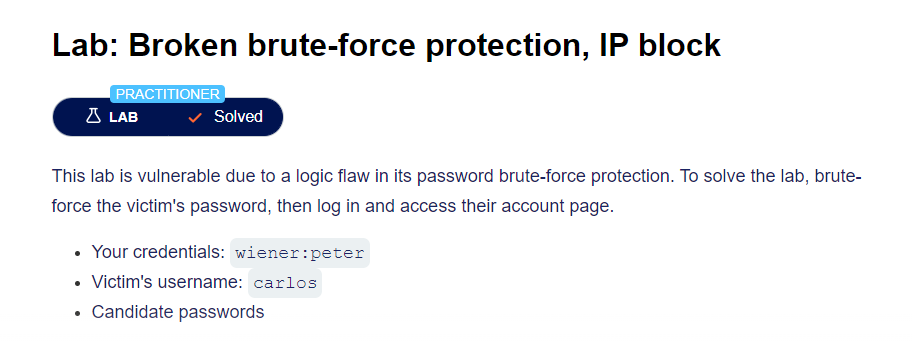

### givens

- valid username and password `wiener:peter`
- victim's username `carlos`
- [Candidate passwords](https://portswigger.net/web-security/authentication/auth-lab-passwords)

## Solution

### step 1 : site discovery

as our main target to login to the site so we head to login page `/login` and enter totally random username and password.

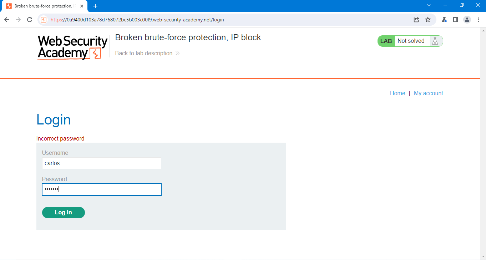

- first of all we will not need username enumeration due to the target account is given.

- let's login with `wiener` and `peter` to see what is happening in the site requests!

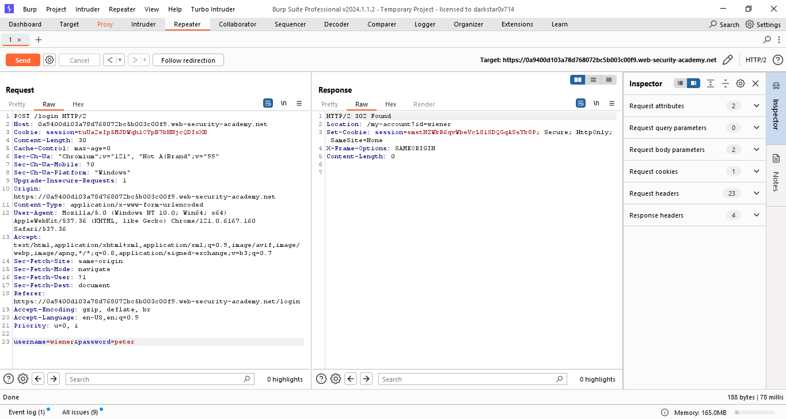

look like any normal request let's send it to repeater to play with it.

when we logged in using `wiener` and `peter` we got some message redirecting status code `302` which mean successful login.

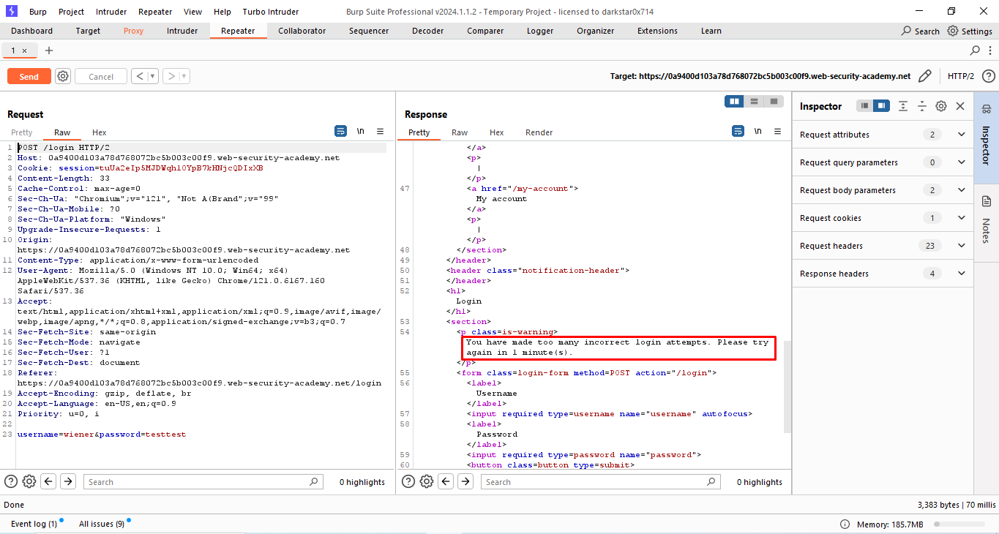

we found a challenging thing it's some kind of `brute force protection` by limit number of tries.

after try same approach in [last lab](../lab3_Username%20enumeration%20via%20response%20timing/README.md) to bypass the protection

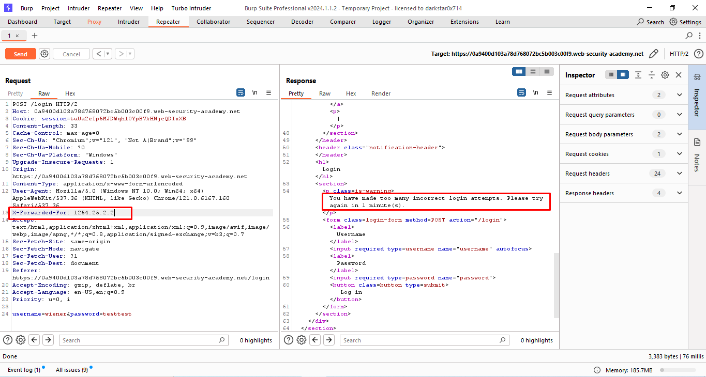

not effective this time as we can't send request with different ip to bypass the protection and we still blocked.

after the min is over i tried with my valid credentials and it opened then after that try another random credentials and give me `incorrect password` message, then my valid credentials, then another try and `incorrect password` again, by trying this 3 time i didn't get any block message!

### step 2 : weaponization phase

1. first of all we need to crafting custom username list and password list to fit our attacking approach.

   - we need to make a user word list each line have one valid username `wiener` and one target user name `carlos` with same length of password list.
   - we can achieve that using crafting an wordlist using python [script](./files/customUsernameListGenerator.py)

```python
def insert_word_between_lines(input_file, output_file, word):
    with open(input_file, 'r') as file:
        lines = file.readlines()
    
    with open(output_file, 'w') as file:
        for i in range(len(lines)-1):
            file.write(word + '\n' + 'carlos' + '\n')
        file.write(word+ '\n' + 'carlos' )

input_file = '../givens/Candidate passwords.txt' # to generate list have same words as passwords list
output_file = 'customUsernameList.txt'
word = 'wiener' #my valid account username

insert_word_between_lines(input_file, output_file, word)
```

2. crafting the given wordlist to fit in our attack approach by the same way with inject valid password between each try also using python [script](./files/customPasswordListGenerator.py).

```python
def insert_word_between_lines(input_file, output_file, word):
    with open(input_file, 'r') as file:
        lines = file.readlines()
    
    with open(output_file, 'w') as file:
        for i in range(len(lines)-1):
            file.write(word + '\n' + lines[i].strip() + '\n')
        file.write(word + '\n' + lines[-1].strip())
                            
input_file = '../givens/Candidate passwords.txt'
output_file = 'customPasswordList.txt'
word = 'peter' #my valid account password

insert_word_between_lines(input_file, output_file, word)
```

as result we have our [custom username list](./files/customUsernameList.txt) and [custom password list](./files/customPasswordList.txt)

### step 3 : password brute force

1. sending request to the intruder and make place holder to username and password, with `Pitchfork` attack type.
   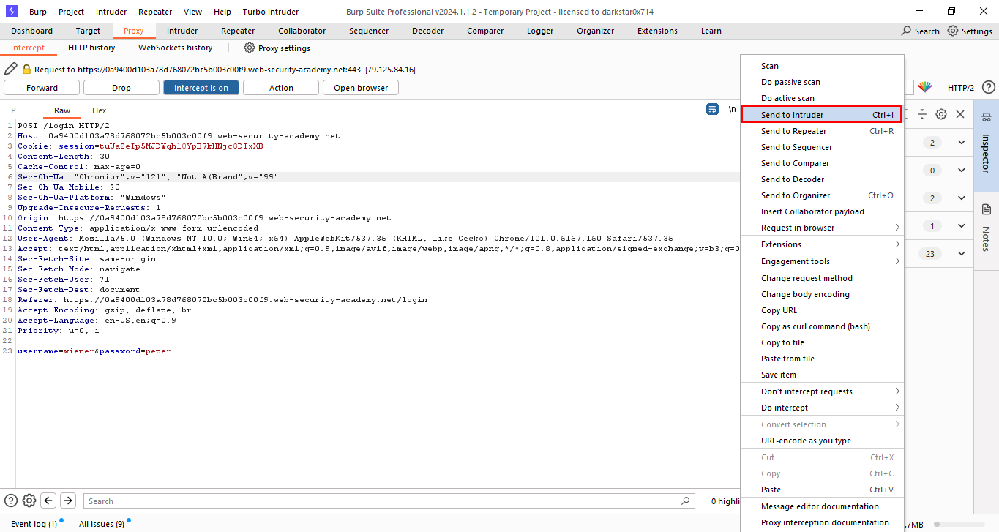
   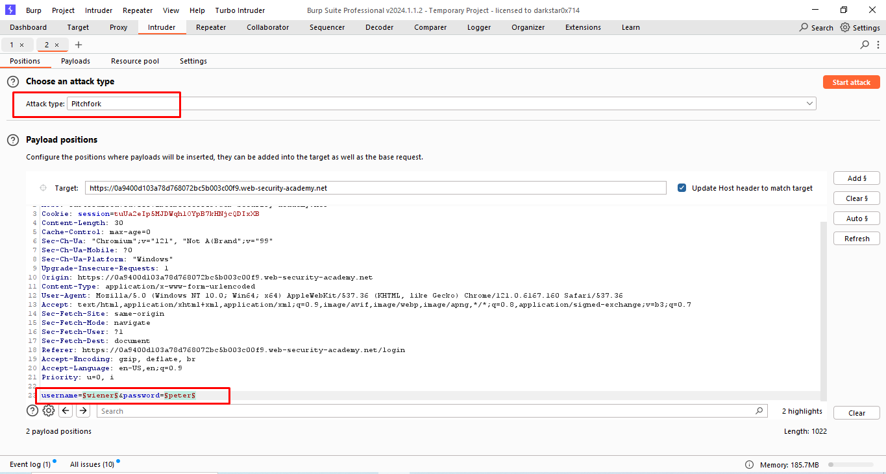

2. changer number of request pet time and set slightly delay between each request to avoid ip block.
   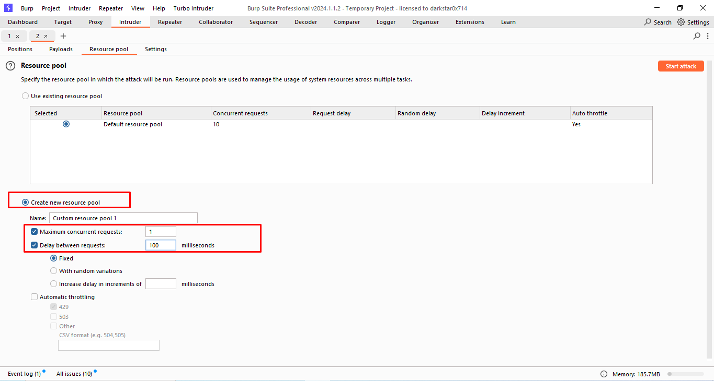

3. load our crafted wordlist set1 is username and set 2 is the passwords.
   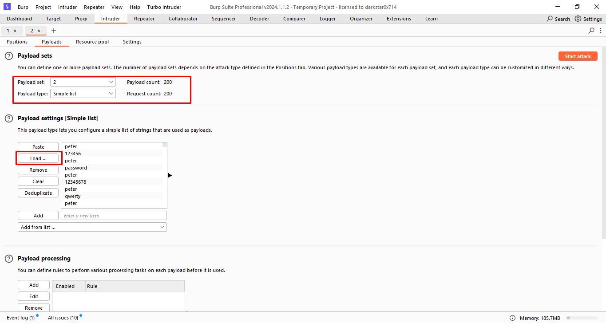

4. after finishing our attack filter the result to show only successful logins using code `3xx` and contain `carlos` word.
   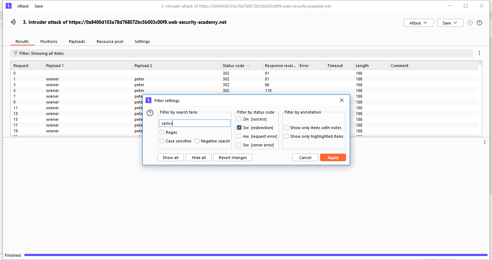

5. now we are done and got valid password for this username `carlos:letmein`.
   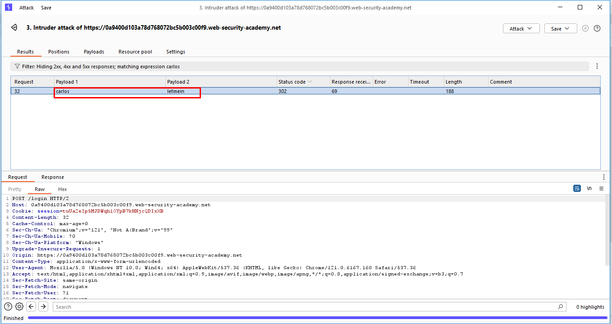

### step 4 : login

to solve lab we need to login with this password and username `carlos` and password `letmein` and we are done.

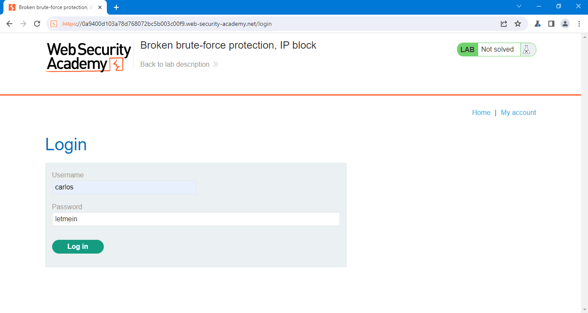
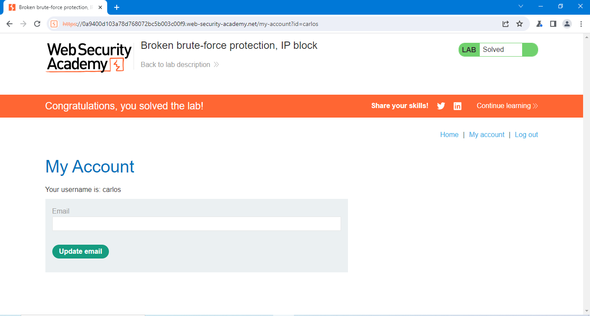

## Notes

- portswigger make random username and password so my credentials may not work with you.
- burp suite community edition make hard limitation on it's speed so you are free to use any tool for this like [hydra](https://www.kali.org/tools/hydra/)
- in hint he mentioned burp extension called `Turbo Intruder` also can solve the challenge.
