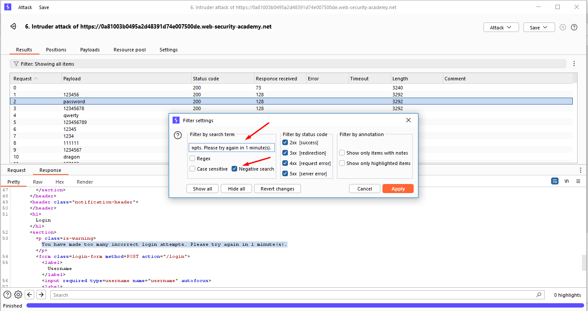

# [Lab5: Username enumeration via account lock](https://portswigger.net/web-security/authentication/password-based/lab-username-enumeration-via-account-lock)

## Lab info

### lab number : 5

### difficulty : PRACTITIONER

### goal : to make successful login

### givens

- [Candidate usernames](https://portswigger.net/web-security/authentication/auth-lab-usernames)
- [Candidate passwords](https://portswigger.net/web-security/authentication/auth-lab-passwords)

## Solution

### step 1 : site discovery

as our main target to login to the site so we head to login page `/login` and enter totally random username and password.

- we got some hard message `Invalid username or password.` which will make our enumeration harder but let's try same approach in [lab1](../lab1_Username%20enumeration%20via%20different%20responses/README.md) but it didn't work.

- let's try same approach in [lab2](../lab2_Username%20enumeration%20via%20subtly%20different%20responses/README.md) but it didn't work too.

- after intercept the request to see if any interesting thing in it, but nothing get my eyes.

look like any normal request let's send it to intruder to brute-force it.

### step 2 : username enumeration

at this point we tried `cluster bomb` attack .

we tried to make more than single request to same username with any password to see if any brute-force protection will trigger or not and start attack.

after viewing and filter the results we found that username called `as` triggered different error messages `You have made too many incorrect login attempts. Please try again in 1 minute(s).`.

which a good indication to username enumeration is done and we got a valid user.

### step 3 : password brute force

by return to the intruder and set username to `as` and repeat all the steps but for password that time.

   
   

after brute force we set filter to show only non-errored massage and sort by response length we found that password is `sunshine`.

### step 4 : login

to solve lab we need to login with this password and username `as` and password `sunshine` and we are done.

## Notes

- portswigger make random username and password so my credentials may not work with you.
- burp suite community edition make hard limitation on it's speed so you are free to use any tool for this like [hydra](https://www.kali.org/tools/hydra/)
