# [Lab1: Username enumeration via different responses](https://portswigger.net/web-security/authentication/password-based/lab-username-enumeration-via-different-responses)

## Lab info

### lab number : 1

### difficulty : APPRENTICE

### goal : to make successful login

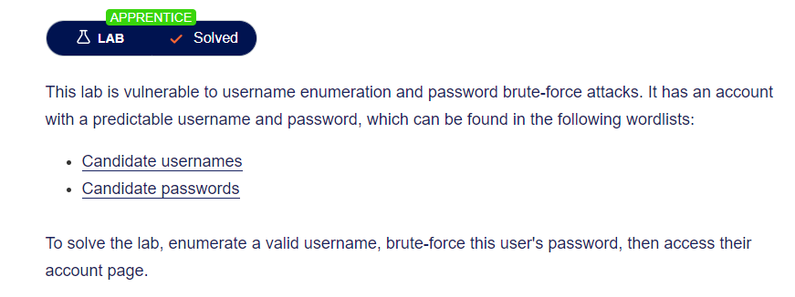

### givens

- [Candidate usernames](https://portswigger.net/web-security/authentication/auth-lab-usernames)
- [Candidate passwords](https://portswigger.net/web-security/authentication/auth-lab-passwords)

## Solution

### step 1 : site discovery

as our main target to login to the site so we head to login page `/login` and enter totally random username and password.

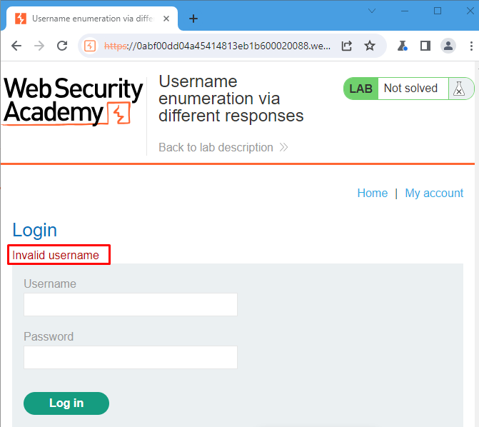
we got some thing interesting here the site tell us that the username is not registered which make our mission a way way easier!

### step 2 : username enumeration

1. first of all open burp-suite and intercept the request then send it to intruder.
   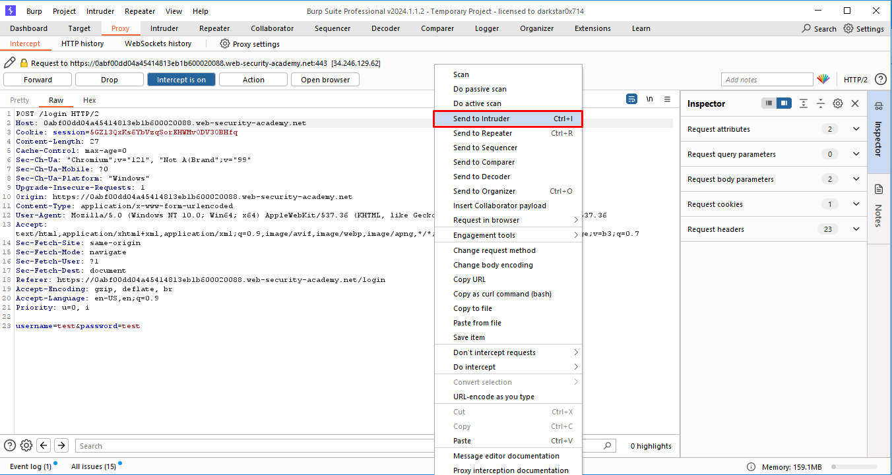
2. set the attack type to `sniper` and select the given username list [list](givens/Candidate%20usernames.txt)
   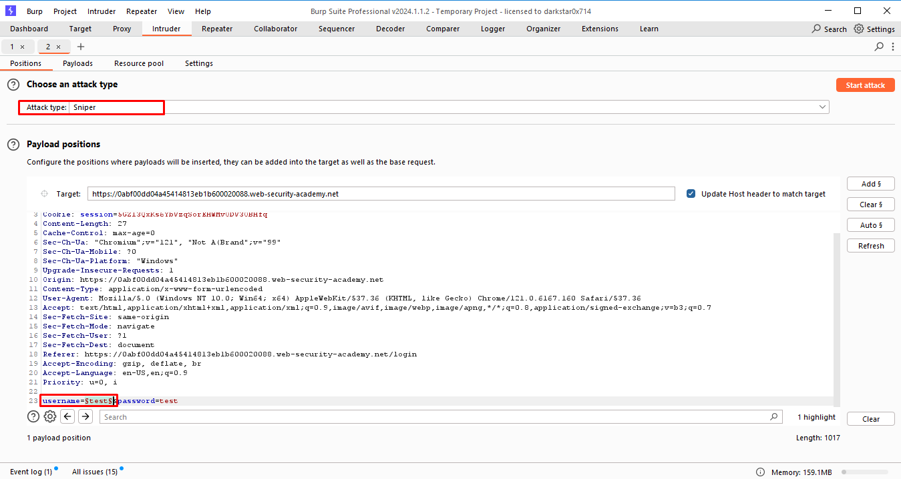
   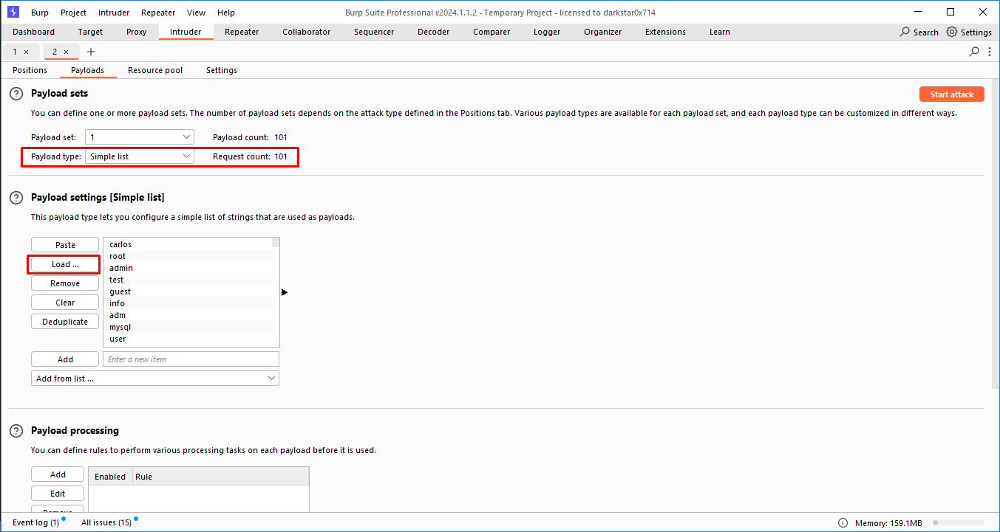
3. after lunch the attack we got some thing interesting here after sorting by `Length` all responses are similar except only one request!
   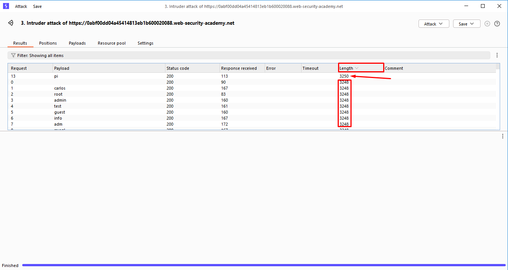
4. after investigate we found that the given username is `pi` and we can login with it.
   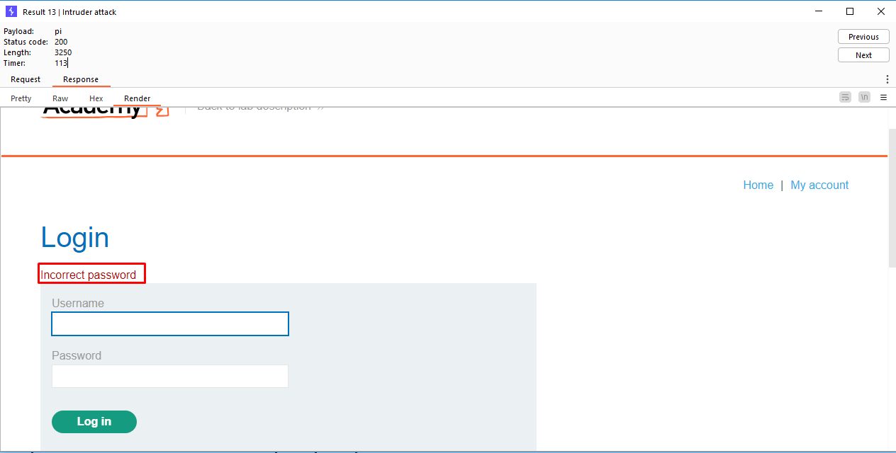

- you can also use burp filter to search in all respond for requests without `Invalid username` message.
  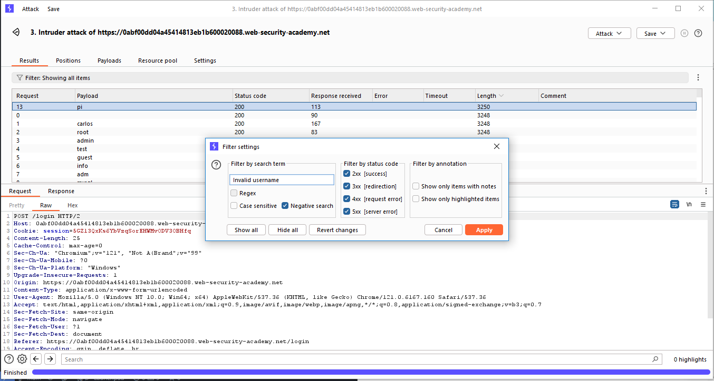

### step 3 : password brute force

1. by return to the intruder and set username to `pi` and repeat all the steps but for password that time.
   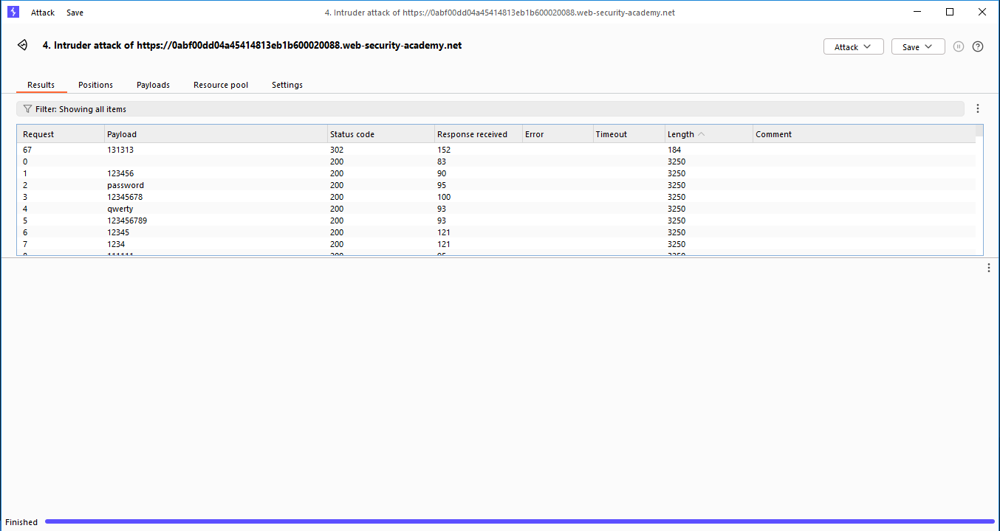
we got the password is `131313`

### step 4 : login

to solve lab we need to login with this password and username `pi` and password `131313` and we are done.

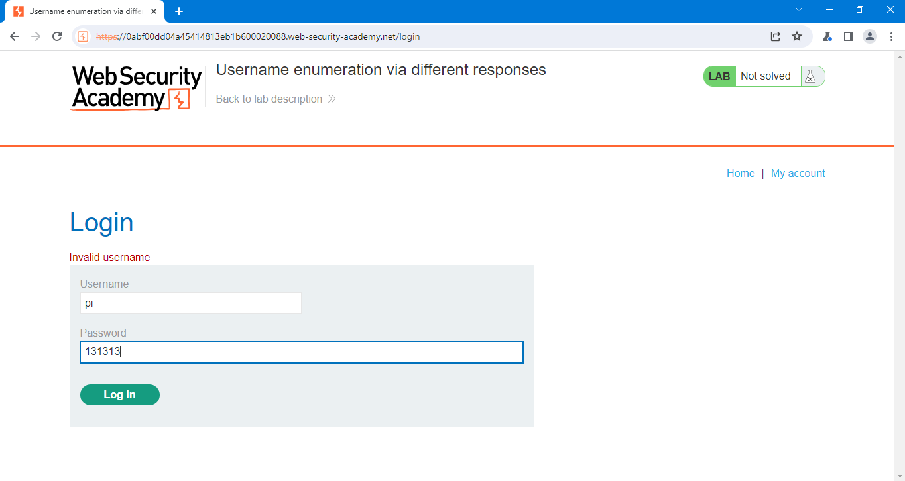
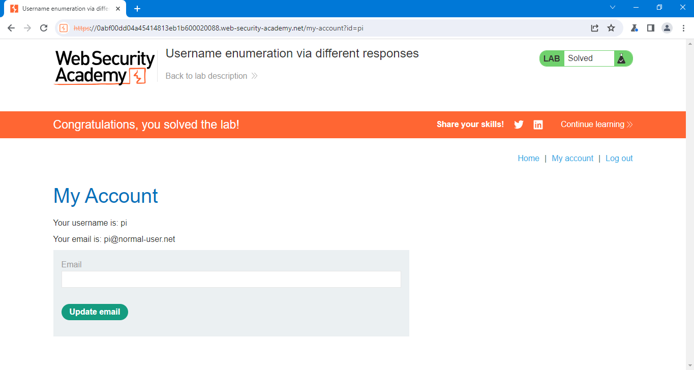
