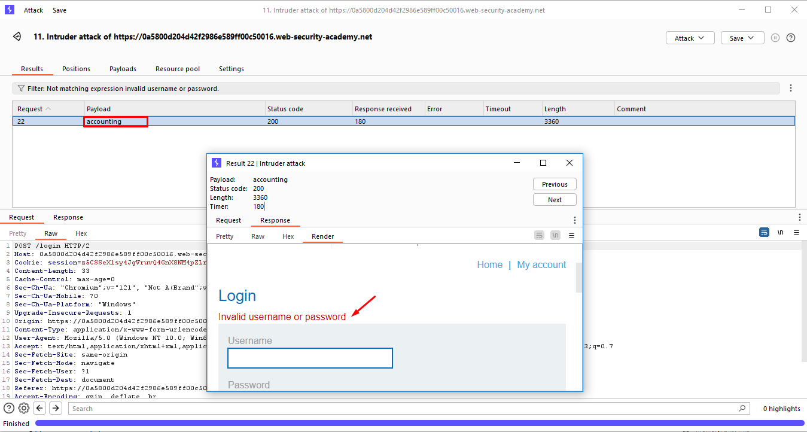

# [Lab2: Username enumeration via subtly different responses](https://portswigger.net/web-security/authentication/password-based/lab-username-enumeration-via-subtly-different-responses)

## Lab info

### lab number : 2

### difficulty : PRACTITIONER

### goal : to make successful login

### givens

- [Candidate usernames](https://portswigger.net/web-security/authentication/auth-lab-usernames)
- [Candidate passwords](https://portswigger.net/web-security/authentication/auth-lab-passwords)

## Solution

### step 1 : site discovery

as our main target to login to the site so we head to login page `/login` and enter totally random username and password.

we got some hard message `Invalid username or password.` which will make our enumeration harder but let's try same approach in [last lab](../lab1_Username%20enumeration%20via%20different%20responses/README.md).

### step 2 : username enumeration

1. first of all open burp-suite and intercept the request then send it to intruder.
   
2. set the attack type to `sniper` and select the given username list [list](givens/Candidate%20usernames.txt)
   
   
3. after launch the attack try to make negative filter to try to find another message.
   
4. after investigate we found strange thing just same message without `.` which make a good indication that we got a valid username is `accounting` and we can login with it.
   

### step 3 : password brute force

1. by return to the intruder and set username to `accounting` and repeat all the steps but for password that time.
   
we got another response code and the password is `7777777`

### step 4 : login

to solve lab we need to login with this password and username `accounting` and password `7777777` and we are done.

## Notes

- portswigger make random username and password so my credentials may not work with you.
- burp suite community edition make hard limitation on it's speed so you are free to use any tool for this like [hydra](https://www.kali.org/tools/hydra/)
- also a full brute force attack can be done by using single cluster bomb from burp suite but it will take a lot of time and nearly 10k requests to finish. 