# [Lab3: Username enumeration via response timing](https://portswigger.net/web-security/authentication/password-based/lab-username-enumeration-via-response-timing)

## Lab info

### lab number : 3

### difficulty : PRACTITIONER

### goal : to make successful login

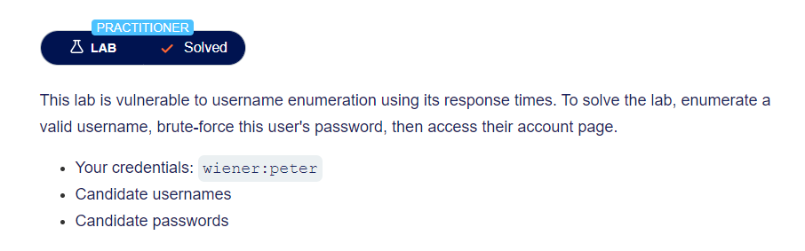

### givens

- valid username and password `wiener:peter`
- [Candidate usernames](https://portswigger.net/web-security/authentication/auth-lab-usernames)
- [Candidate passwords](https://portswigger.net/web-security/authentication/auth-lab-passwords)

## Solution

### step 1 : site discovery

as our main target to login to the site so we head to login page `/login` and enter totally random username and password.

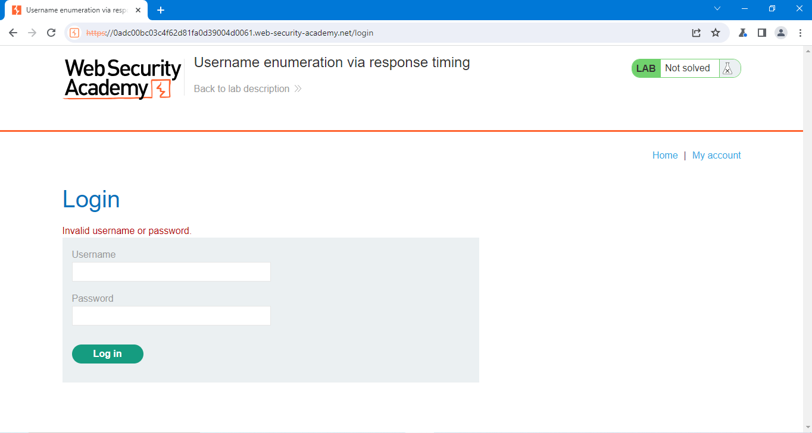

- we got some hard message `Invalid username or password.` which will make our enumeration harder but let's try same approach in [lab1](../lab1_Username%20enumeration%20via%20different%20responses/README.md) but it didn't work.

- let's try same approach in [lab2](../lab2_Username%20enumeration%20via%20subtly%20different%20responses/README.md) but it didn't work too.

- let's login with `wiener` and `peter` to see what is happening in the site requests!

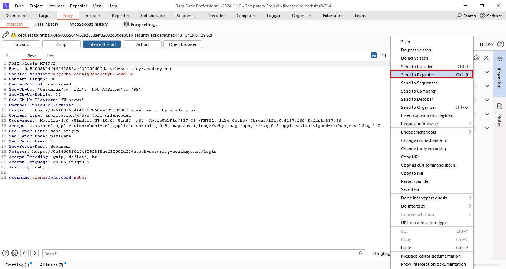

look like any normal request let's send it to repeater to play with it.

when we logged in using `wiener` and `peter` we got some message redirecting status code `302` which mean successful login.

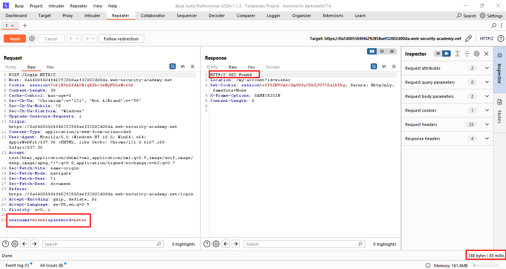

another interested thing to look for is response time for this request.

let's try some totally random username and password and see the response time.

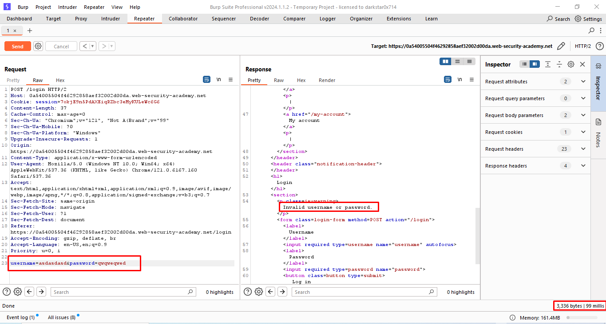

we got some message `Invalid username or password.` which is not very interesting, specially for that each time we send same request we got different response time.

but we found a challenging thing it's some kind of `brute force protection` by limit number of tries.

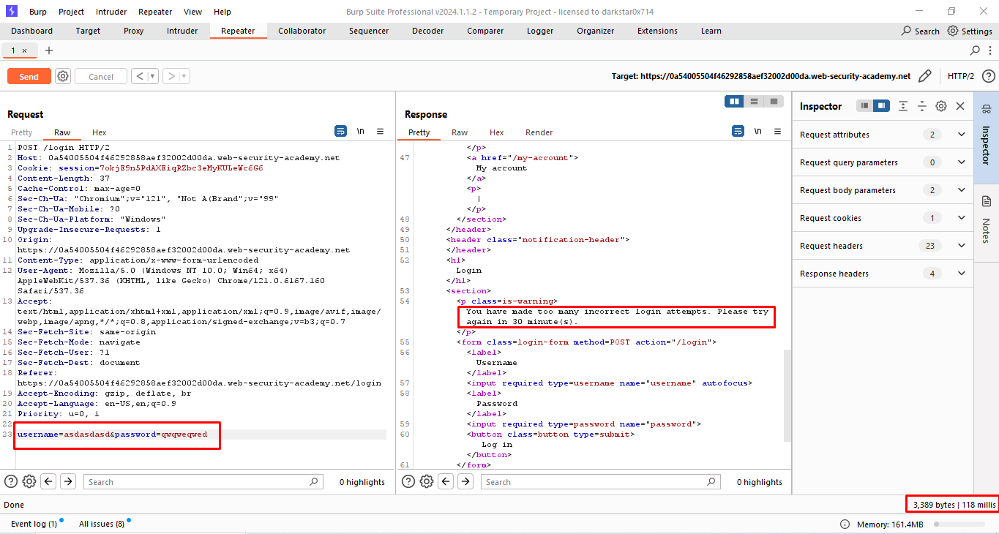

to bypass this protection firstly try to change forward ip header know more about it [here](https://developer.mozilla.org/en-US/docs/Web/HTTP/Headers/X-Forwarded-For).

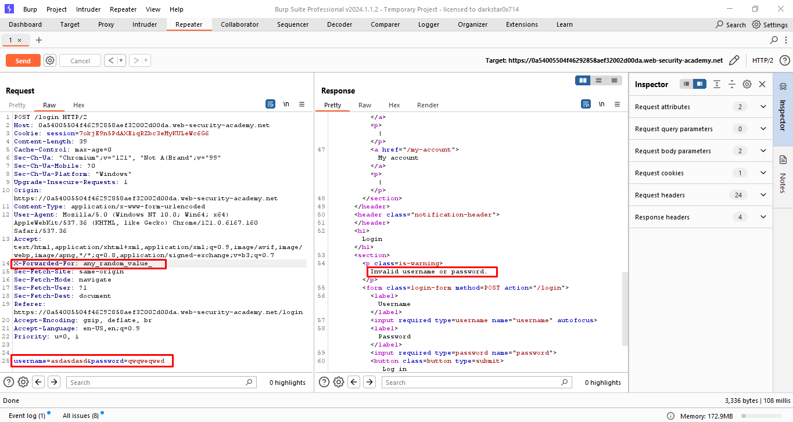

as expected we now can send each request with different ip to bypass the protection.

### step 2 : username enumeration

1. first of all open burp-suite and intercept the request then send it to intruder.

2. set the attack type to `Battering-ram` with making payload positions to each ip and user name and select the given username list [list](givens/Candidate%20usernames.txt) also add the given user name to payload list.
   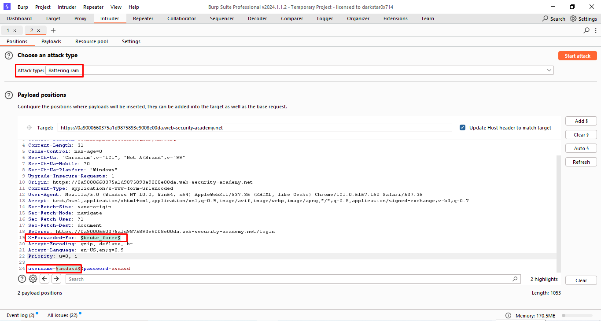
   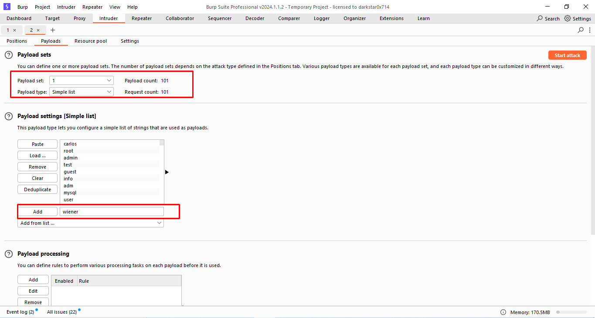
3. after launch the attack we enable response time to show.
   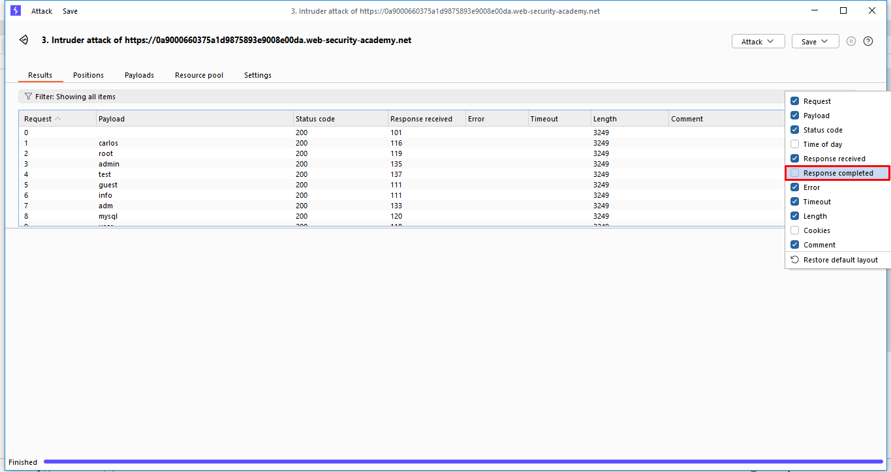
4. after some sorting using different columns we didn't got any thing interested.
   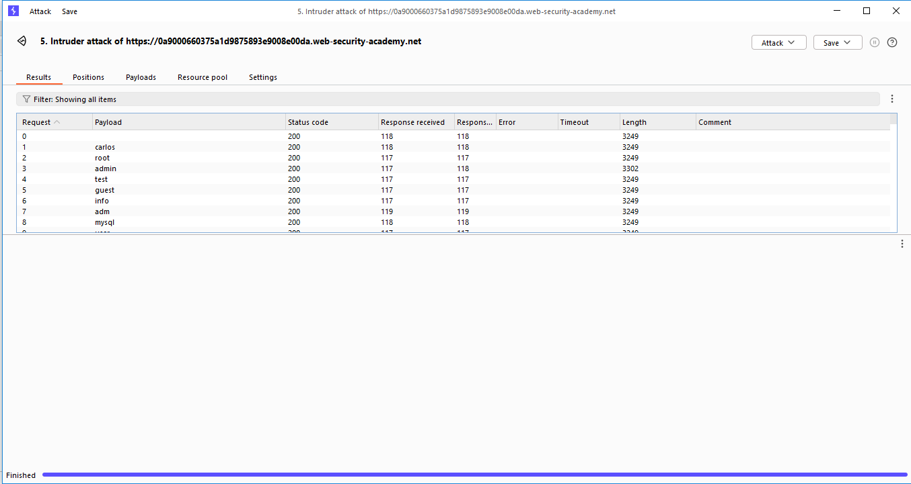
5. good challenge to try harder, at this time we set the password to an extremely long password to make compare take to long and make response time noticeable, it's a common practice in web application development to compare username to database then if and only if match check the password, so by making password too long make the compare in right username take too long to respond.
   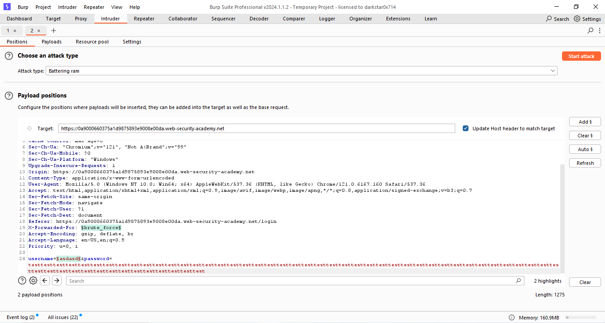
6. and we get some interesting response time in given account and another account which a good indication of successful username `apache` .
   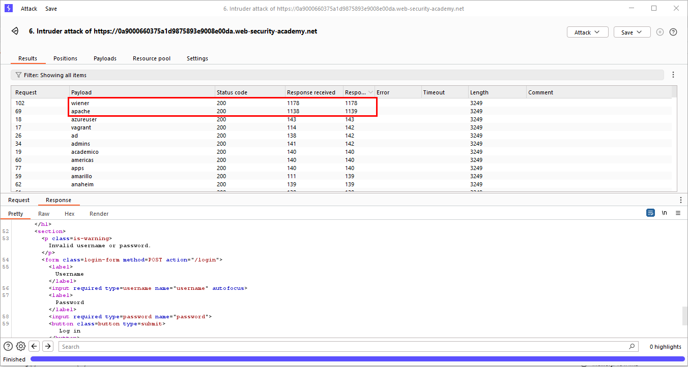

### step 3 : password brute force

1. by return to the intruder and set username to `apache` and repeat all the steps but for password that time.
   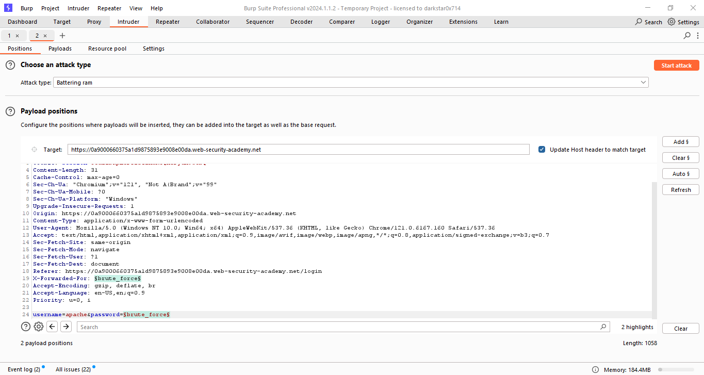
   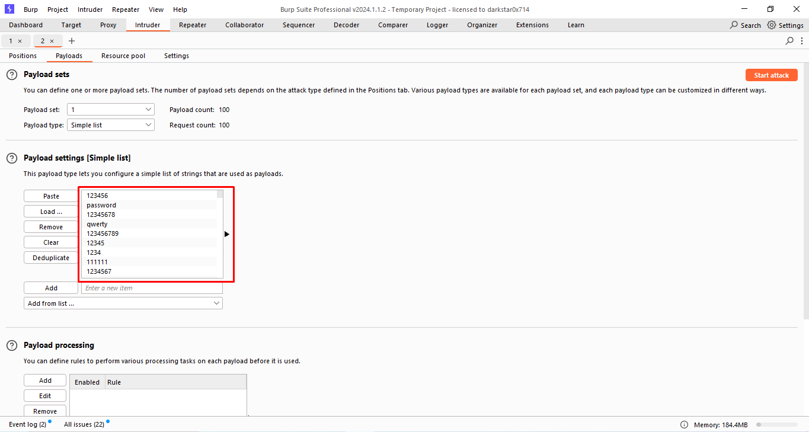
we got another response code and the password is `sunshine`
   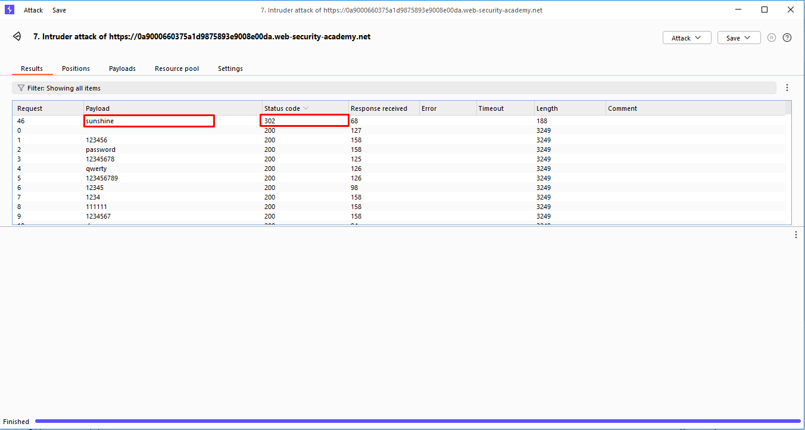

### step 4 : login

to solve lab we need to login with this password and username `apache` and password `sunshine` and we are done.

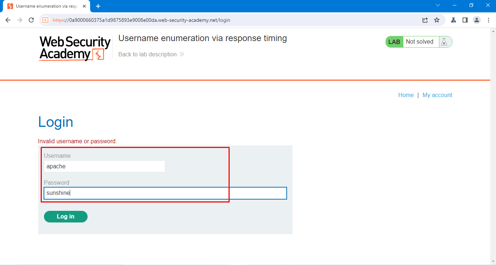
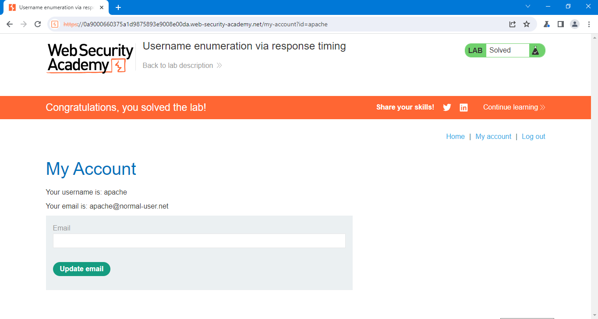

## Notes

- portswigger make random username and password so my credentials may not work with you.
- burp suite community edition make hard limitation on it's speed so you are free to use any tool for this like [hydra](https://www.kali.org/tools/hydra/)
- also a full brute force attack can be done by using single cluster bomb from burp suite but it will take a lot of time and nearly 10k requests to finish.
